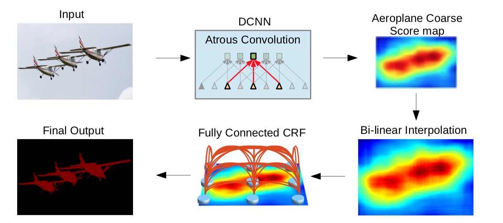
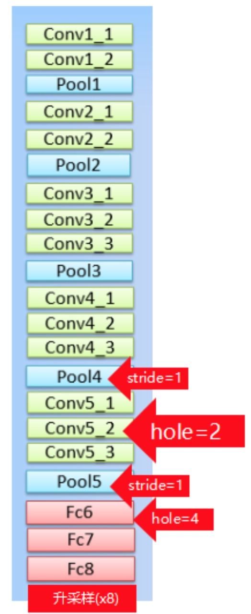
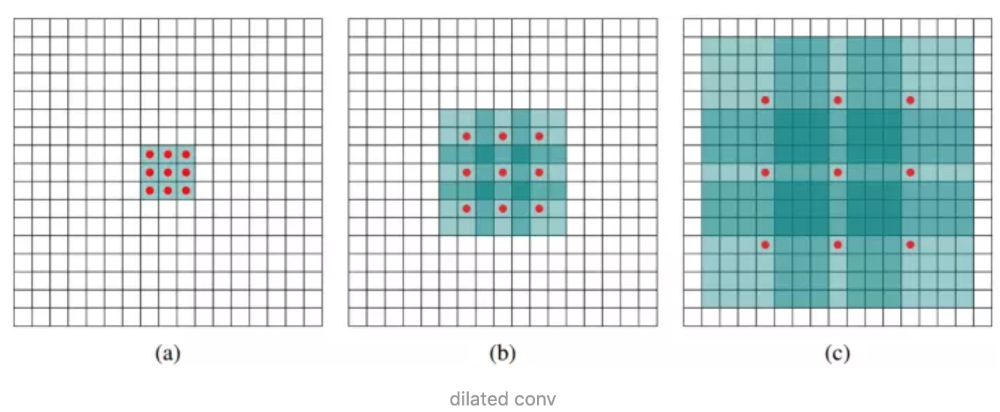
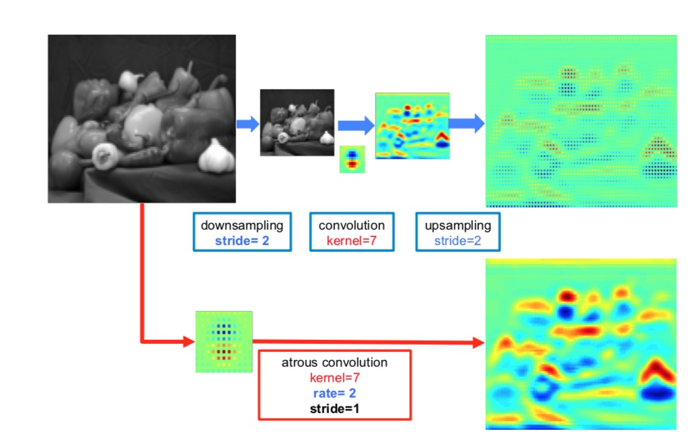
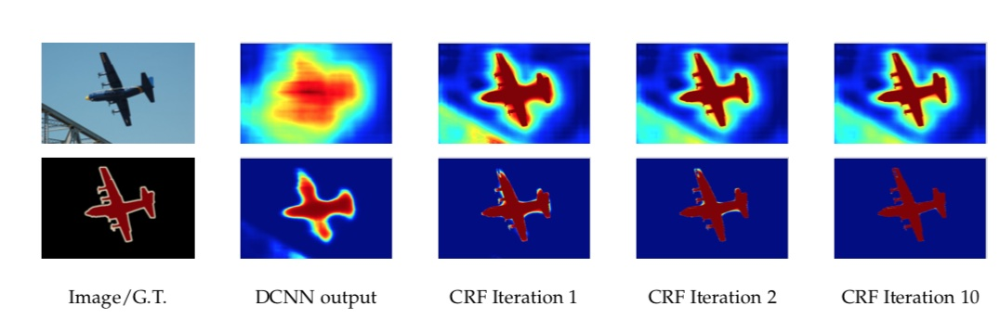
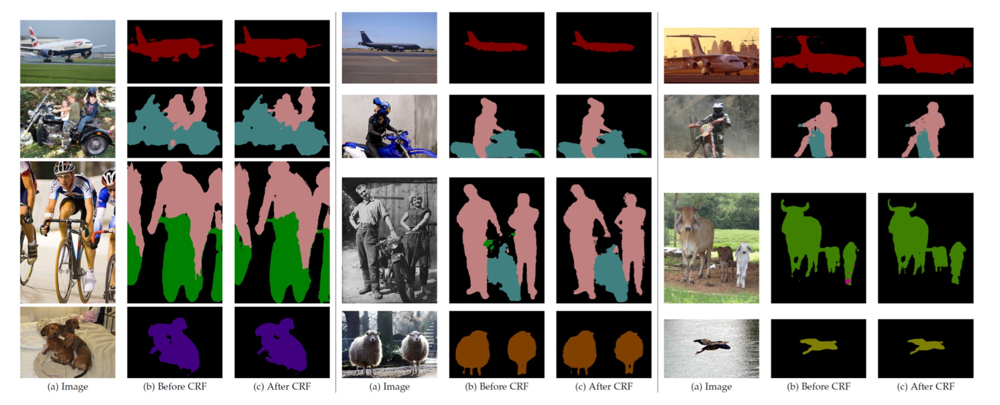

# 6.4 DeepLab系列

### 学习目标

* 目标
  * 知道DeepLab系列算法的特点
  * 说明DeeplabV1的结构特点
  * 掌握DeeplabV1的空洞卷积与CRF应用
* 应用
  * 无

### 6.4.1 DeepLab 背景

相比于传统的视觉算法(SIFT或HOG)，Deep-CNN以其end-to-end方式获得了很好的效果。这样的成功部分可以归功于**Deep-CNN对图像转换的平移不变性(invariance)**，这根本是源于重复的池化和下采样组合层。平移不变性增强了对数据分层抽象的能力，但同时可能会阻碍低级(low-level)视觉任务,例如姿态估计、语义分割等，**在这些任务中我们倾向于精确的定位而不是抽象的空间关系。**

Deep-CNN在图像标记任务中存在两个技术障碍：

* 信号下采样：在Deep-CNN中重复最大池化和下采样带来的分辨率下降问题，分辨率的下降会丢失细节。
  * 理解：也就是小物体信息无法重建 (假设有四个pooling layer 则 任何小于 2^4 = 16 pixel 的物体信息将理论上无法重建。)

* 空间不敏感(invariance)：分类器获取以对象中心的决策是需要空间变换的不变性，这就限制了Deep-CNN的定位精度
  * 比如对于同一张图片进行空间变换（如平移、旋转），其图片分类结果是不变的。对于图像分割等Low-Level Vision Task，对于一张图片进行空间变换后，其结果是改变的。

**High-Level & Low-level vision task**

CNN适合于Hight-Level Vision Task（如图像分类），不太适合于Low-Level Vision Task（如图像分割、姿态估计）。

* lower level feature ：也叫高级的语义信息，包括边缘检测，角点检测，颜色之类的对细节敏感、抽象度比较低的任务。

* high level feature：一些表面，表观的信息，比如纹理、边缘。目标检测、图像分类等对细节信息不敏感、抽象度比较高的任务。

### 6.4.2 Deeplab V1介绍

在实验中发现DCNNs做语义分割时精准度不够的问题，根本原因是DCNNs的高级特征的平移不变性(即高层次特征映射)。

* DeepLab是结合了**深度卷积神经网络(DCNNs)和概率图模型(DenseCRFs)的方法**。
  * 系统与其他先进模型的主要区别在于DenseCRFs和DCNN的结合。**是将每个像素视为CRF节点，利用远程依赖关系，并使用CRF推理直接优化DCNN的损失函数**。拓展：Koltun(2011)的工作表明完全连接的CRF在语义分割下非常有效。



#### 6.4.2.1 密集分类下的卷积神经网络

#### 1、结构



* 1、把最后的**全连接层FC6、7、8改造成卷积层**
* 2、**pool4的stride由2变为1，则紧接着的conv5_1, conv5_2和conv5_3中hole size为2。接着pool5由2变为1, 则后面的fc6中hole size为4。**
* 3、fc7,8为标准卷积

> 注：由于Hole（Atrous convolution）算法让feature map更加dense，所以网络直接用差值升采样就能获得很好的结果，而不用去学习升采样的参数了（FCN中采用了de-convolution）

###### 问题：FCN中有两个关键，一个是pooling减小图像尺寸增大感受野，另一个是upsampling扩大图像尺寸。在先减小再增大尺寸的过程中，肯定有一些信息损失掉了，那么能不能设计一种新的操作，不通过pooling也能有较大的感受野看到更多的信息呢？答案就是dilated conv/atrous conv

#### 2、空洞卷积的使用

DeepLab是**采用的atrous（带孔）算法扩展感受野，获取更多的上下文信息**

  从两个角度考虑空洞卷积：

* **相当于在标准概念的kernel（卷积核）中，相邻点之间添加(rate - 1)个0**，然后使用扩张后的kernel（卷积核）与原图进行卷积。下面的图rate=2，相当于标准的3x3卷积核变为5x5卷积核，每一行中间添加(2-1)个0

  * 也就是说3x3的kernel在rate为2的情况下得到相当于5x5的空洞kernel，但是只有图中的9个点的权重不为0，其余都为0。 可以看到虽然kernel size只有3x3，但是这个卷积的感受野已经增大到了7x7。

  

* 1、dilated的好处是不做pooling损失信息的情况下，加大了感受野，让每个卷积输出都包含较大范围的信息。采样率为r的空洞卷积插入r−1个零，将k×k的卷积核变为ke=k+(k−1)(r−1)而不增加计算量。**下图表示含有空洞卷积和不用空洞卷积的效果。结果就是使用采样率计算更加密集的特征映射。**



* 2、增大感受野的同时，不增加参数数量

##### 3、问题：

* signal down-sampling
  * 问题：DCNNs每一层重复执行下采样 （如max-pooling和downsampling），导致signal分辨率降低。
  * 将stride改小，能得到更加dense的feature map，可是却也带来了另外一个问题即receptive field（RF）变小的问题。
  * 将Hole（Atrous convolution）算法应用到DCNNs模型上来扩展感受野，获取更多的上下文信息。
* spatial “insensitivity”（invariance）
  * 问题：以获取图像中物体为核心的决策（High Level Vision Task，如图片分类、目标检测任务）需要空间不变性，即DCNNs的high-level的平移不变性（invariance），导致DCNNs做语义分割时定位精准度不够。
  * 将DCNNs层的响应和 完全连接条件随机场（Fully Connected CRFs）结合（DeepLab是由两个非常成熟的模块(DCNN和CRFs)级联而成）

##### 5、API实现

tf.nn.atrous_conv2d(value, filters, rate, padding, name=None)

> value： 指需要做卷积的输入图像，要求是一个4维Tensor，具有[batch, height, width, channels]这样的shape，具体含义是[训练时一个batch的图片数量, 图片高度, 图片宽度, 图像通道数]
>
> filters： 相当于CNN中的卷积核，要求是一个4维Tensor，具有[filter_height, filter_width, channels, out_channels]这样的shape，具体含义是[卷积核的高度，卷积核的宽度，图像通道数，卷积核个数]，同理这里第三维channels，就是参数value的第四维
>
> rate： 要求是一个int型的正数，正常的卷积操作应该会有stride（即卷积核的滑动步长），但是空洞卷积是没有stride参数的，这一点尤其要注意。取而代之，它使用了新的rate参数，那么rate参数有什么用呢？它定义为我们在输入图像上卷积时的采样间隔，你可以理解为卷积核当中穿插了（rate-1）数量的“0”，把原来的卷积核插出了很多“洞洞”，这样做卷积时就相当于对原图像的采样间隔变大了。具体怎么插得，可以看后面更加详细的描述。此时我们很容易得出rate=1时，就没有0插入，此时这个函数就变成了普通卷积。
>
> padding： string类型的量，只能是”SAME”,”VALID”其中之一，这个值决定了不同边缘填充方式。

```python
img =tf.constant(value=[[[[1],[2],[3],[4]],
             [[1],[2],[3],[4]],
             [[1],[2],[3],[4]],
             [[1],[2],[3],[4]]]],dtype=tf.float32)
img =tf.concat(values=[img,img],axis=3)
filter =tf.constant(value=1, shape=[3,3,2,5], dtype=tf.float32)
out_img1 =tf.nn.atrous_conv2d(value=img, filters=filter, rate=1, padding='SAME')
out_img2 =tf.nn.atrous_conv2d(value=img, filters=filter, rate=1, padding='VALID')
out_img3 =tf.nn.atrous_conv2d(value=img, filters=filter, rate=2, padding='SAME')
#error
#out_img4 = tf.nn.atrous_conv2d(value=img, filters=filter, rate=2, padding='VALID')
print('rate=1, SAME mode result:')
print(sess.run(out_img1.numpy()))
print('rate=1, VALID mode result:')
print(sess.run(out_img2.numpy()))
print('rate=2, SAME mode result:')
print(sess.run(out_img3.numpy())) # error #print 'rate=2, VALID mode result:' #print(sess.run(out_img4))
```

#### 6.4.2.2 CRF的应用

##### 1、背景

* DCNN的预测物体的位置是粗略的，没有确切的轮廓。图像输入CNN是一个被逐步抽象的过程，原来的位置信息会随着深度而减少甚至消失

##### 2、CRFs for accurate localization

* CRF：简单来讲就是每个像素点作为节点，像素与像素间的关系作为边，即构成了一个条件随机场。通过二元势函数描述像素点与像素点之间的关系，鼓励相似像素分配相同的标签，而相差较大的像素分配不同标签。
  * CRF在传统图像处理上主要做平滑处理。就是在决定一个位置的像素值时，会考虑周围邻居的像素值，这样能抹除一些噪音。
* 但对于CNN来说，short-range CRFs可能会起到反作用，因为我们的目标是恢复局部信息，而不是进一步平滑图像。引入fully connected CRF来考虑全局的信息。

效果：



##### 3、论文CRF设置

全连接CRF模型使用的能量函数$$E(x)$$
$$
E(x)=\sum_i\theta_i(x_i)+\sum_{ij}\theta_{ij}(x_i,y_j)
$$

* x：对全局pixels的概率预测分布

* xi：其中一个pixel的概率预测分布

* θi：一元势函数 unary potential function，定义在观测序列位置i的状态特征函数，用于**刻画观测序列对标记变量的影响**

  * 则：

  $$
  \theta_i(x_i)=-\log P(x_i)
  $$

* θi：二元势函数 unary potential function，定义在不同观测位置上的转移特征函数，用于**刻画变量之间的相关关系以及观测序列对其影响**（实质是像素之间的关系）

  * 则：

  * 其中$$k^m(f_i,f_j)$$为$$(f_i,f_j)$$之间的高斯核，fi是像素i的特征向量，例如像素点i的特征向量fi用(x,y,r,g,b)表示。对应的权重为$$w_{m}$$

  * $$
    \theta_{ij} (x_i,y_j)=u(x_i,x_j)\sum^K_{m=1}\omega_m\cdot k^m(f_i,f_j)
    $$

  * 在DeepLab中高斯核采用双边位置和颜色组合，式为：第一核取决于像素位置(p)和像素颜色强度(I)，第二个核取决于像素位置(p).

    * $$
      \omega_1\exp-\frac{||p_i-p_j||^2}{2\sigma_{\alpha}^2}-\frac{||I_i-I_j||^2}{2\sigma_{\beta}^2})+\omega_2\exp(-\frac{||p_i-p_j||^2}{2\sigma_{\gamma}^2})
      $$

总结：**二元势函数是描述像素和像素之间的关系，如果比较相似，那可能是一类，否则就裂开，这可以细化边缘。一般的二元势函数只取像素点与周围像素之间的边，这里使用的是全连接，即像素点与其他所有像素之间的关系。**

#### 6.4.2.3 主要贡献

* 速度：带`atrous`算法的DCNN可以保持8FPS的速度，全连接CRF平均推断需要0.5s
* 准确：在PASCAL语义分割挑战中获得了第二的成绩
* 简单：DeepLab是由两个非常成熟的模块(DCNN和CRFs)级联而成

### 6.4.3 DeepLab V1 实验

* 损失函数：输出的特征图与ground truth下采样8倍做交叉熵和。
* 训练数据label：对**原始Ground Truth进行下采样8倍**，得到训练label。
* 预测数据label：对预测结果进行**双线性上采样8倍**，得到预测结果。

测试细节：

| item         | set                                                |
| :----------- | :------------------------------------------------- |
| 数据集       | PASCAL VOC 2012 segmentation benchmark             |
| DCNN模型     | 权重采用预训练的VGG16                              |
| DCNN损失函数 | 交叉熵                                             |
| 训练器       | SGD，batch=20                                      |
| 学习率       | 初始为0.001，最后的分类层是0.01。每2000次迭代乘0.1 |
| 权重         | 0.9的动量， 0.0005的衰减                           |

* DeepLab由DCNN和CRF组成，训练策略是分段训练，即DCNN的输出是CRF的一元势函数，在训练CRF时是固定的。
* DeepLab由DCNN和CRF组成，训练策略是分段训练，即DCNN的输出是CRF的一元势函数，在训练CRF时是固定的。在对DCNN做了fine-tune后，对CRF做交叉验证。这里使用ω2=3和σγ=3在小的交叉验证集上寻找最佳的$$\omega_1,\sigma_{\alpha},\sigma_{\beta}$$,采用从粗到细的寻找策略。

#### CRF和多尺度的表现

经过DeepLap之后的效果和之前的效果对比：



### 6.4.4 总结

* DeepLab系列算法的特点
* DeeplabV1的结构特点
* DeeplabV1的空洞卷积与CRF应用