# 6.5 DeepLab V2 & V3& V3+

### 学习目标

* 目标
  * 说明V2的ASPP结构以及使用深度网络Resnet
  * 说明V3的ASPP+结构
  * 说明V3+（V4）的Xception引入和具有Encder-decoder的ASPP
* 应用
  * 无

DeepLabv1 在三个方向努力解决，但是问题依然存在：特征分辨率的降低、物体存在多尺度，DCNN的平移不变性。

### 6.5.1 DeepLab V2

#### 6.5.1.1 改变特点

* atrous convolution
* **采用ASPP ( atrous spatial pyramid pooling) 多尺度获得更好的分割效果**
* **合并深度卷积网络和概率图模型方法，增强对物体边界的定位。**
* 基础层由VGG16转为ResNet

**和v1不同：**

* 通过多尺度输入处理或者多孔空间金字塔池化，可以更好地分割物体。
* DeepLab采用最新的ResNet图像分类深度卷积神经网络构建，与原来基于VGG-16的网络相比，取得了更好的语义分割性能。

#### 6.5.1.2 Astrous conv

结构如下：

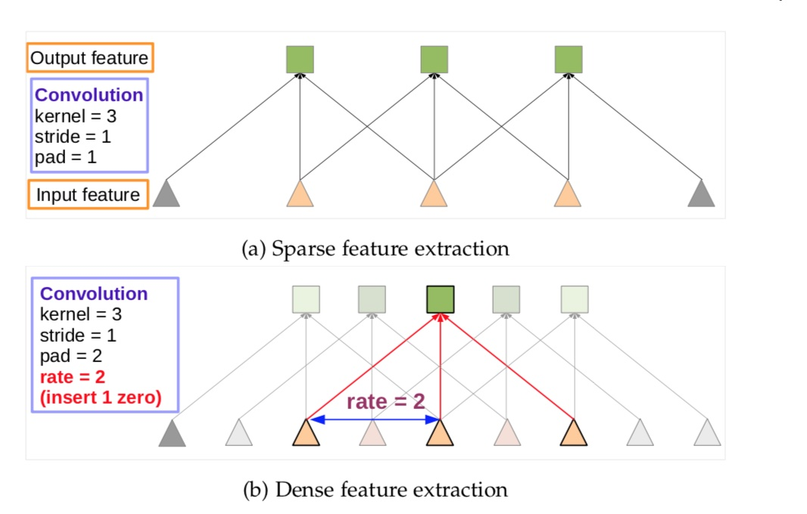

#### 6.5.1.3 ASPP

使用多个不同采样率上的多个并行多孔卷积层。每个采样率上提取的特征再用单独的分支处理，融合生成最后的结果。

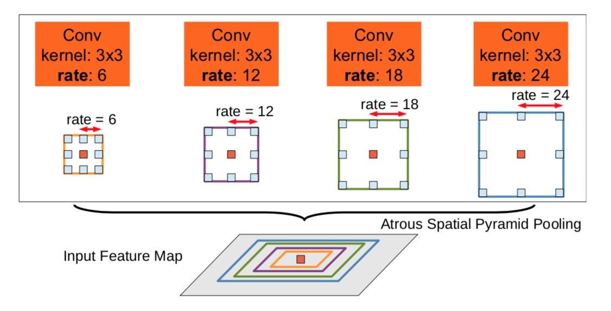

多孔空间金字塔池化（ASPP）。为了分类中间像素（橙色），ASPP用不同采样率的多个并行滤波器开发了多尺度特征。视野有效区用不同的颜色表示。

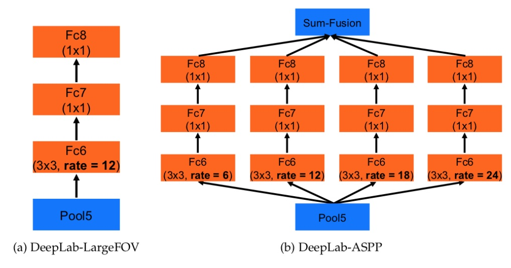

* DeepLab-LargeFOV 使用 rate=12的空洞卷积
* DeepLab-ASPP 使用 不同 rate 的多个 filter 在 multiple scales 获得物体和内容，有不小的提升。

#### 6.5.1.4 CRF

与DeepLabv1一样

#### 6.5.1.5 训练

DeepLabv2在PASCAL VOC 2012, PASCAL-Context, PASCALPerson- Part, and Cityscapes四个数据集上做了评估。

训练细节：

| 项目         | 设置                                          |
| :----------- | :-------------------------------------------- |
| DCNN模型     | 权重采用预训练的VGG16，ResNet101              |
| DCNN损失函数 | 输出的结果与ground truth下采样8倍做像素交叉熵 |
| 训练器       | SGD，batch=20                                 |
| 学习率       | 初始为0.001，最后的分类层是0.01               |
| 权重         | 0.9的动量， 0.0005的衰减                      |

* **模型对预训练的VGG16和ResNet101模型做fine-tune。训练时DCNN和CRF的是解耦的，即分别训练**，训练CRF时DCNN输出作为CRF的一元势函数输入是固定的。

* 大概训练验证手段是对CRF做交叉验证。使用ω2=3和σγ=3在小的交叉验证集上寻找最佳的ω1,σα,σβ,采用从粗到细的寻找策略。

####6.5.1.6 效果

PASCAL VOC 2012，在PASCAL VOC 2012上评估了DeepLab-CRF-LargeFOV模型，这里做了三个主要的改进：

* 1.训练期间使用不同的学习策略；
* 2.使用ASPP模块；
* 3.使用深度网络和多层次处理.

### 6.5.2 DeepLab V3

#### 6.5.2.1 V3的改进

* 连续池化和下采样，使特征分辨率下降，不利于定位。
* 全局特征或上下文之间的互相作用有助于做语义分割，4种解决目标多尺度问题的结构
* **去除条件随机场CRF**

#####  V3的改进

* 1、提出了更通用的框架，适用于任何网络
* 2、改进了ASPP：由不同采样率的空洞卷积和BN层组成，我们尝试以级联或并行的方式布局模块。
* 3、**讨论了一个重要问题**：使用大采样率的3×3 的空洞卷积，因为图像边界响应无法捕捉远距离信息，会退化为1×1的卷积,  将图像级特征融合到ASPP模块中。

#### 6.5.2.2 V3工作

V3做了一个总结，全局特征或上下文之间的互相作用有助于做语义分割，下面是四种不同类型利用上下文信息做语义分割的全卷积网络。

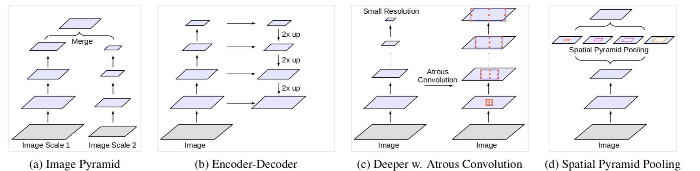

* 图像金字塔(Image pyramid)：小尺度的输入响应控制语义，大尺寸的输入响应控制细节。通过拉布拉斯金字塔对输入变换成多尺度，传入DCNN，融合输出。
  * 这类的缺点是：因为GPU存储器的限制，对于更大/更深的模型不方便扩展。通常应用于推断阶段。
  * **高斯金字塔**(Gaussianpyramid): 用来向下采样，主要的图像金字塔
  * **拉普拉斯金字塔**(Laplacianpyramid): 用来从金字塔低层图像重建上层未采样图像
* 编码器-解码器(Encoder-decoder)：**编码器的高层次的特征容易捕获更长的距离信息，在解码器阶段使用编码器阶段的信息帮助恢复目标的细节和空间维度。**
  * 例如SegNet利用下采样的池化索引作为上采样的指导；U-Net增加了编码器部分的特征跳跃连接到解码器；RefineNet等证明了Encoder-Decoder结构的有效性。
* 上下文模块(Context module)：包含了额外的模块用于级联编码长距离的上下文。有效的方法是DenseCRF并入DCNN中，共同训练DCNN和CRF。
* 空间金字塔池化(Spatial pyramid pooling)：**采用空间金字塔池化可以捕捉多个层次的上下文。**
  * 在ParseNet中从不同图像等级的特征中获取上下文信息；DeepLabv2提出ASPP，以不同采样率的并行空洞卷积捕捉多尺度信息。PSPNet在不同网格尺度上执行空间池化，并在多个数据集上获得优异的表现。

#### 6.5.2.3 架构

* Deeplab 把在 ImagNet 上预训练得到的 ResNet 作为它的主要特征提取网络。

* 最后一个 ResNet Block
  * 顶部使用了空洞空间金字塔池化 (ASPP，Atrous Spatial Pyramid Pooling)
  
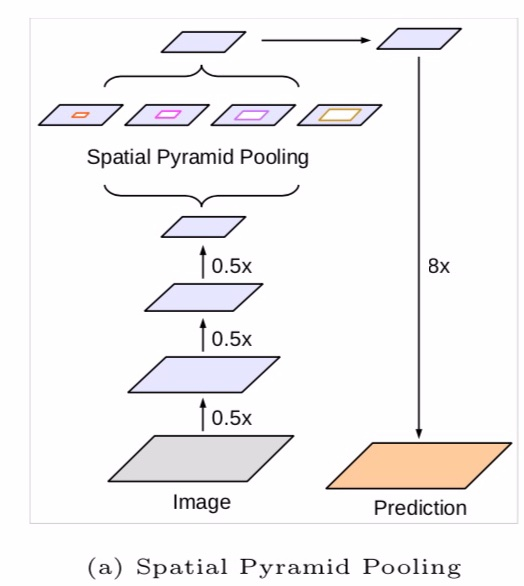
  
  

#####下面表示空洞卷积提取密集特征、讨论空洞卷积模块以级联（**串行**）和**并行**布局

##### 1、Model 1 ：Going Deeper with Atrous Convolution

串行的空洞卷积模型（modules with atrous convolution laid out in cascade）变得更深了。

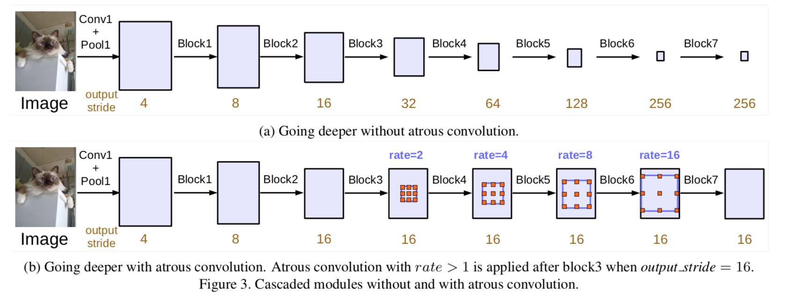

采用串行的ResNet，级联block为block5、block6、block7(均为block4的复制)。**输出步长为16.在没有使用带孔卷积的情况下它的输出步长是256。**

##### Multi-grid Method

对block4～block7 采用不同atrous rates

##### 2、Module 2 ：Parallel modules with atrous convolution (ASPP)

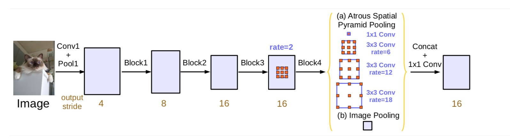

* 1、为了增加全局的语境信息，**ASPP 还通过全局平均池化（GAP global average pooling）**获得图像级特征。即将特征做全局平均池化，经过卷积，再融合。
* 将image pooling得到的图像级特征输入到一个1×1 convolution with 256 filters(加入 batch normalization)中
  * 然后将特征进行双线性上采样(bilinearly upsample)到特定的空间维度

* 2、**改进的ASPP由一个 1×1 卷积，和三个 3×3卷积组成**，步长为（6，12，18），输出步长为16
  
* 3、**ASPP所有分支处理好的特征以及image pooling 卷积上采样之后的特征将会 concat 在一起通过另一个 1×1 卷积（也有着256个filter，加入BN）**

* 4、最后还有一个 1×1 卷积产生最终的分类；**条件随机场（CRF）被去除了，模型比较简洁易懂。**

这个版本的 ASPP 包含 4 个并行的操作:

* 一个 1×1 的卷积
* 三个 3×3 的卷积（扩张率分别是（6,12,18）） 特征图的标称步长（nominal stride）是 16.

#### 6.5.2.4 实验

总结：

* 1、级联模块越多，准确率越好，速度下降
* 2、使用Multi_Grid 方法比原来要好
* 3、使用Hole卷积 ，步长越小，准确率越好，速度下降
* 4、**ASPP最好的模型准确率高于级联带孔卷积模型的最优值，选择ASPP作为我们最终的模型。**

##### PASCAL VOC 2012效果

在 PASCAL VOC-2012 达到 86.9 mIOU

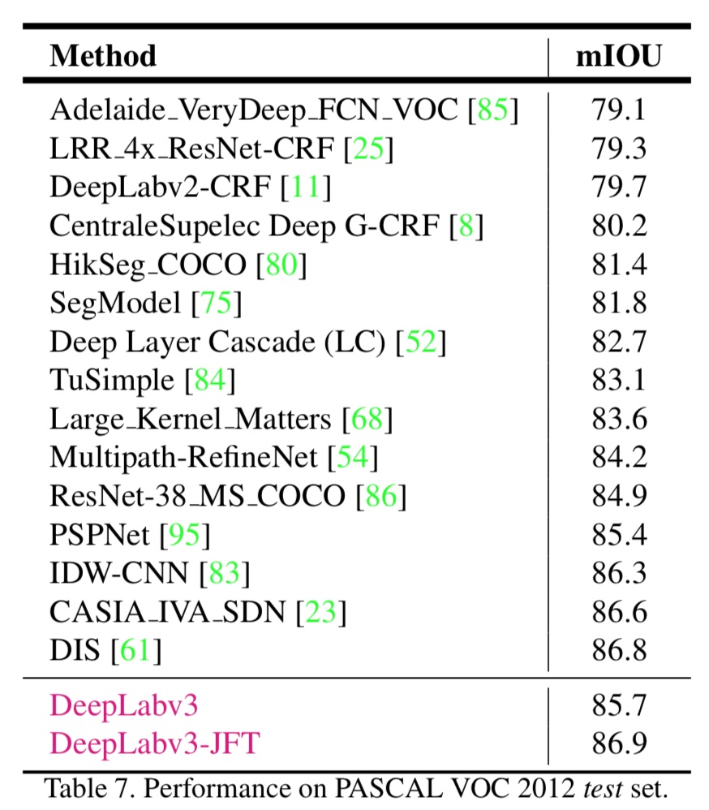

##### 1、训练设置

| 部分       | 设置                                                         |
| ---------- | ------------------------------------------------------------ |
| 数据集     | PASCAL VOC 2012                                              |
| 工具       | TensorFlow                                                   |
| 剪裁尺寸   | 采样513大小的裁剪尺寸                                        |
| 学习率策略 | 采用poly策略，在初始学习率基础上$(1 - \frac{iter}{max_iter})power$,其中power=0.9 |
| BN层策略   | 1、**output_stride=16时，采用batchsize=16，同时BN层的参数做参数衰减0.9997**。 2、在增强的数据集上，**以初始学习率0.007训练30K后，冻结BN层参数**。 |
| 上采样策略 | 之前将最终的输出与GroundTruth下采样8倍做比较。发现保持GroundTruth更重要，所以将最终的输出上采样8倍与完整的GroundTruth比较。 |

2、级联使用多个带空洞卷积的block模块

| 参数                | 效果                                                         |
| :------------------ | :----------------------------------------------------------- |
| OS（output_stride） | OS（output_stride）越小，mIOU越高。stride=256，信号严重抽取，性能大大下降 |
| Hole                | 使用空洞卷积                                                 |
| ResNet              | 网络越深，block越多，效果越好                                |
| Multi-grid          | 主分支的三个卷积都使用空洞卷积，Multi-gird策略 （1,2,1）时+网络越深 效果越好 |

3、ASPP设置

| 提高效果的方法 | 设置                                                         |
| :------------- | :----------------------------------------------------------- |
| Method         | Multi-grid （1,2,4）+APSS（6,12,18）+Image Pooling           |
| OS             | 小                                                           |
| inputs         | Multi-scale input during test Adding left-right flipped inputs |
| pretrained     | Model pretrained on MS-COCO                                  |

| 参数                    | 效果                                                         |
| :---------------------- | :----------------------------------------------------------- |
| 同时使用上采样和BN      | 越好                                                         |
| batch_size              | 越大效果越好                                                 |
| eval output_stride 影响 | train output_stride = 16 , eval output_stride=8/16时，效果越好 |

### 6.5.3 V3总结

* 1、**Deeplab v3的级联模型和ASPP模型在PASCAL VOC 2012的验证集上表现都要比Deeplab v2好**
* 2、提升主要来自增加了调好的批次归一化参数和更好地编码多尺度上下文信息

### 6.5.4  DeepLab v3+

2018年2月份，Google 团队在 arXiv 放出了 DeepLabv3+，**在语义分割领域取得新的 state-of-the-art 水平。**

DeepLabv3+ 继续在模型的架构上作文章，**为了融合多尺度信息，引入语义分割常用的 encoder-decoder。**在 encoder-decoder 架构中，引入可任意控制编码器提取特征的分辨率，通过空洞卷积平衡精度和耗时。

#### 6.5.4.1 与DeepLab V3对比

* deeplab v3 缺陷
  * **输出图放大的效果不好，信息太少**

* 改进
  * 1、encoder-decoder
    * 设计基于v3的 decode module
    * 把中间一层的特征图用于输出图放大
    * 为了融合多尺度信息，引入语义分割常用的 encoder-decoder
  * 2、Xception

#### 6.5.4.2 结构

####  结构对比

1、是v3的纵式结构；2、是常见的编码—解码结构3、V3+提出的基于deeplab v3的encode-decode结构

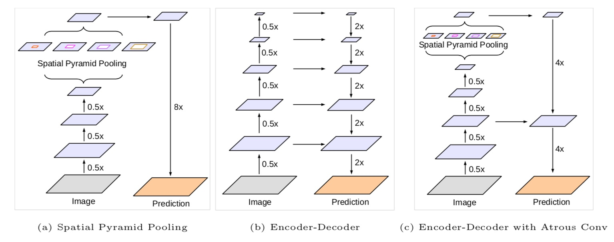

#### 1、V3+结构细节

在语义分割任务中采用 Xception 模型，在 ASPP 和解码模块使用depthwise separable convolution，提高编码器-解码器网络的运行速率和健壮性

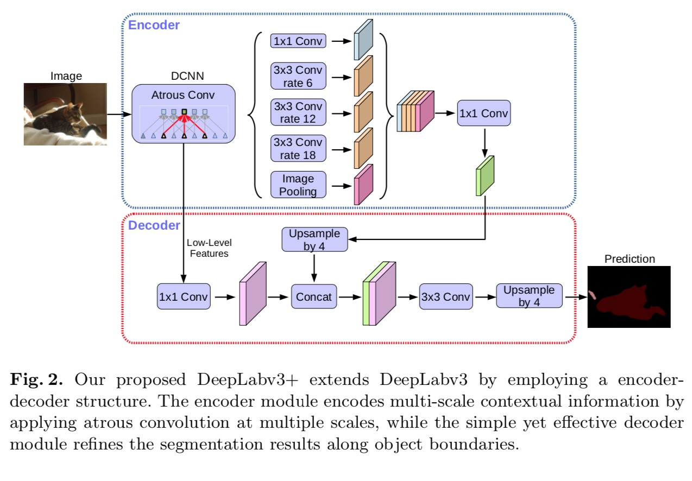

* encoder 的output feature 首先 经过一个 1×1 conv，然后 bilinearly 向上采样4倍
* 和具有相同空间分辨率的低层特征concat
* 再经过一个3×3 conv ，上采样4倍

#### 2、Modified Aligned Xception（修正对齐的Xception）

* 1、**Entry flow 保持不变，添加了更多的 Middle flow。**
* **2、所有的 max pooling 被 depthwise separable convolutions 替代。**
* 3、在每个 3x3 depthwise convolution 之外，增加了 batch normalization 和 ReLU。

其中三种不同的卷积对比：

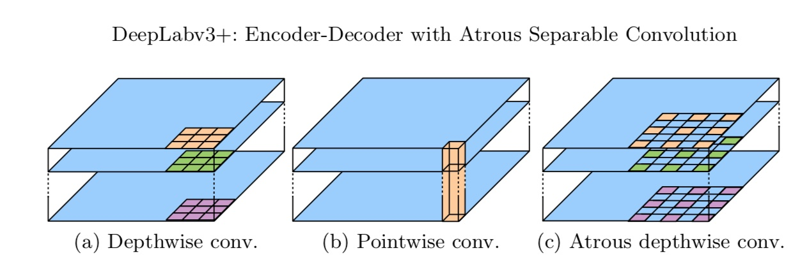

Sep Conv是深度可分离卷积（Depthwise separable convolution）

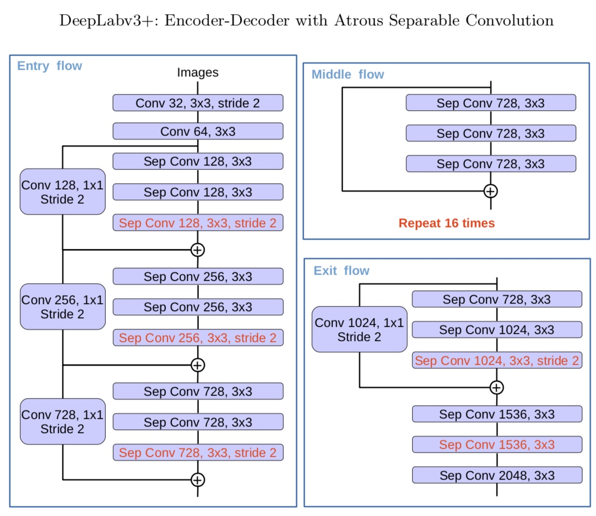

#### 6.5.4.3 训练细节

| 部分          | 设置                                                         |
| ------------- | ------------------------------------------------------------ |
| 数据集        | PASCAL VOC 2012（1464 (train)、1449 (val)和1456 (test)像素级注释图像） |
| 工具          | TensorFlow                                                   |
| Pretrained    | ImageNet-1k pretrained ResNet-101 or modified aligned Xception |
| 学习率策略    | 采用poly策略，在初始学习率基础上$(1 - \frac{iter}{max_iter})power$,其中power=0.9，初始0.007 |
| crop size     | 513 ×513                                                     |
| output_stride | 16                                                           |
| Train         | ent-to-end                                                   |

#### 6.5.4.4 实验效果

* 两个结构：论文提出的模型在主干网络 ResNet-101 和 Xception均进行验证。两种方式均在 ImageNet 预训练。其中 Xception 预训练过程中，**使用 50 个 GPU，每个 GPU batch size=32，分辨率 299x299。Xception 相比 ResNet-101，在 Top-1 和 Top-5 分别提高 0.75% 和 0.29%。**

* 数据集具体结果：在 PASCAL VOC 2012 数据集上取得新的 state-of-art 表现，89.0 mIOU。**使用 depthwise separable convolution，使用 Pretraining on COCO 和 Pretraining on JFT，在这些 tricks 辅助下，PASCAL VOC 2012 test set 达到惊人的 89.0%，取得新的 state-of-the-art 水平。**

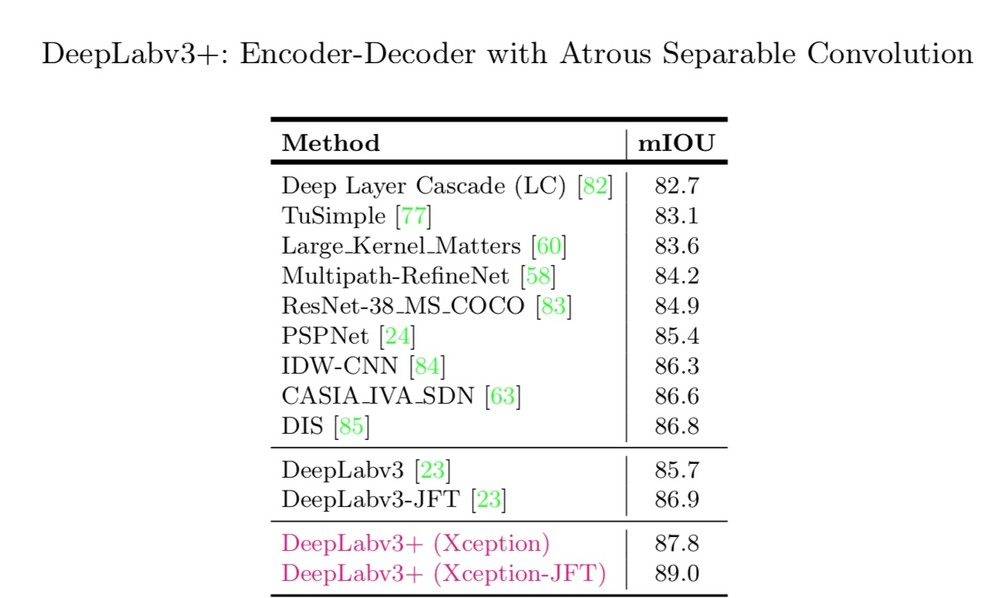

### 6.5.5 DeepLab系列总结

从 DeepLabv1-v4 系列看，空洞卷积必不可少。从 DeepLabv3 开始去掉 CRFs。 DeepLabv1-v4 没有用很多 tricks，都是从网络架构中调整，主要是如何结合多尺度信息和空洞卷积。

| 架构            | DeepLabv1 | DeepLabv2 | DeepLabv3 | DeepLabv3+ |
| --------------- | --------- | --------- | --------- | ---------- |
| Backbone        | VGG-16    | ResNet    | ResNet+   | Xception   |
| Atrous Conv     | √         | √         | √         | √          |
| CRF             | √         | √         | ×         | ×          |
| ASPP            | ×         | ASPP      | ASPP+     | ASPP+      |
| Encoder-decoder | ×         | ×         | ×         | √          |

### 6.5.6 小结

* V2的ASPP结构以及使用深度网络Resnet
* V3的ASPP+结构
* V3+（V4）的Xception引入和具有Encder-decoder的ASPP