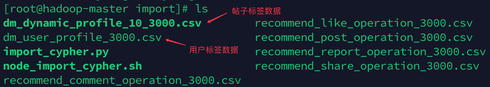
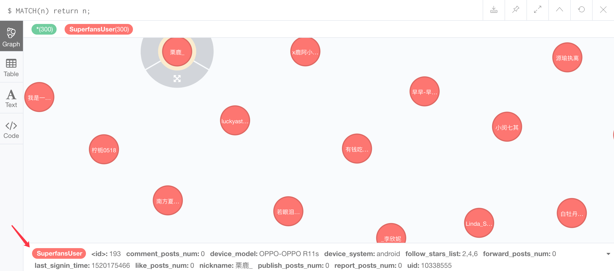
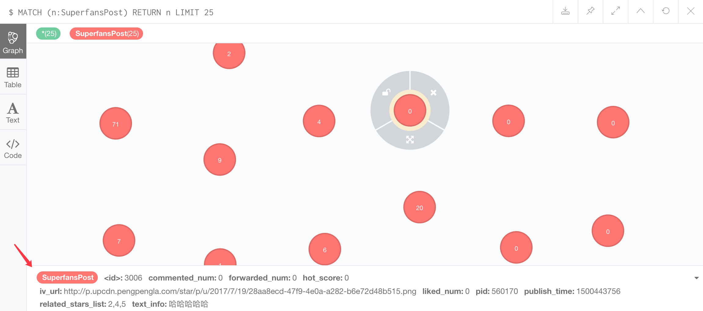
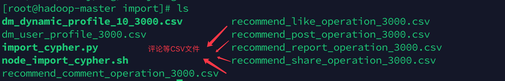

# 2.2 泛娱乐画像图谱存储

## 学习目标

- 目标
  - 知道双画像的设计
- 应用
  - 应用完成用户与帖子标签的数据库导入

### 2.2.1 画像图谱存储

前面介绍的Web业务当中，需要进行实时推荐，那么我们需要从neo4j图谱数据中找到某个用户的推荐结果推荐出去。所以我们会把产品中历史的所有用户、帖子以及它们之间的关系进行导入到neo4j中。

* 用户、帖子的标签当做neo4j图数据库中的节点标签以及属性
  * SuperfansUser
  * SuperfansPost
* 用户与帖子的行为关系名称当做neo4j图数据库的边的关系类型、属性

### 2.2.1 什么是双画像

- 双画像是指: 用户画像和帖子画像
-  设计标签体系:
  - 标签分类：
    - 静态标签: 用户/帖子中不能/很少变动的属性，如用户昵称，帖子发布时间
      - 包括用户昵称，年龄，星座，所持设备类型，价格，个性签名等。
    - 动态标签: 用户/帖子可能一直处在变动状态的属性，如用户的主动点赞次数，帖子被评论的次数
      - 最近浏览的明星，最近登陆时间，主动点赞次数，主动评论次数，主动转发次数等。
    - 业务关注类标签：业务部门可能对某些标签特别感兴趣，如用户的付费情况
      - 比如用户付费情况, 购买和消费情况。
    - 挖掘类标签：有些标签不能直接通过打点直接获得，而是需要使用一些数据挖掘方法，比如从个人评论内容中识别他的兴趣爱好
      - 将用户的个性签名和历史评论内容使用标签化系统进行兴趣倾向预测，获得对应标签。
  - 标签更新周期：随APP版本更新迭代.
  - 你选择的标签要尽可能的和推荐目标有关，同时与数据打点和采集工程师讨论标签设计的合理性.

### 2.2.2 泛娱乐推荐双画像设计

#### 2.2.2.1 画像来源与存储设计

* 用户与帖子标签数据的确定

与业务数据部门进行沟通，确定所需要的用户与帖子标签数据，然后要求他们导出到CSV文件到固定目录，我们将其放入到neo4j安装的import目录。我们放入 /home/neo4j/import/，在虚拟机当中已经包含了所有的数据导入到了neo4j中。



#### 2.2.2.1 用户标签

* 用户画像：用户ID，设备信息，**评论数量**，使用系统，**关注数量**，最后登录时间，**喜欢帖子数量**，匿名，**发表帖子数量**，**回复帖子数量**，uid



#### 2.2.2.2 帖子标签

- 帖子静态标签：帖子的静态标签体系：包括帖子关联明星，发布时间，title，帖子来源，发布的明星等。

- 帖子动态标签：用户的动态标签体系: 最近被浏览的次数，被点赞次数，被评论次数，被转发次数等。

- 挖掘类标签：将帖子title和评论内容使用标签化系统进行兴趣倾向预测，获得对应标签。

每一列分别代表：pid, 发布时间戳, 涉及的明星列表, 被赞评转的次数，图片/视频地址, 携带的文本信息

```
614540,1514897310,[25, 32,321],37,2,0,https://p.upcdn.pengpengla.com/star/p/u/2018/1/2/59d50372-222b-4482-af34-1fbf3c1fc558.jpg,羡慕你身边的所有人，也想和你一起生活，嫉妒使我更加喜欢你，2018愿你拥有好运气❤
614544,1514901161,[423, 1,2],2,0,0,https://p.upcdn.pengpengla.com/star/p/u/2018/1/2/84dbb033-b240-45c9-81b6-9ef6b06c8d29.jpg,第一天！哈哈哈哈哈哈哈，才知道有这个功能唉
614552,1514906051,[234],6,0,1,https://p.upcdn.pengpengla.com/star/p/u/2018/1/2/de4082ab-9b82-403e-a60d-5b31a96b5458.jpg,阳光少年🐒️哈哈哈
614566,1514984023,[3,2,1],3,0,0,https://p.upcdn.pengpengla.com/star/p/u/2018/1/3/e0b07d44-0b66-4cec-ba90-383d7f59197f.png,一直喜欢你❤❤❤
614570,1514995252,[234,3,4],0,0,0,https://p.upcdn.pengpengla.com/star/p/u/2018/1/4/1cc2e223-504f-4a11-bfcc-801a3e22d1df.jpg,就是爱你么么哒
```



#### 2.2.2.3 标签体系的计算与存储

标签体系按照定义进行计算，并每周进行一次更新，存储方式采用双层存储模式，Hbase将会记录所有历史标签数据，以便计算产生基于此的新标签。**Neo4j会存储所有最新的标签数据，并负责将双标签体系融合。**

对数据可视化和推荐的可解释性产生重要影响

- 双层存储
  - 数据合集存于能扩展存储的分布式数据之中, 如：Hbase, 最新/使用数据存在利于快速查询的数据库之中，如：neo4j
- 用户、帖子标签当做节点以及标签
- 用户与帖子的关系，关注，评论等当做图中的关系边

#### 用户与帖子属性数据导入neo4j

* 用户、帖子节点以及标签的导入：

使用LOAD CSV FROM导入CSV文件数据，

```
## User Node Import
LOAD CSV FROM
'file:///dm_user_profile_3000.csv' AS line
CREATE (:SuperfansUser {uid: toInteger(line[0]), nickname: line[1], device_model:line[2], device_system:line[3], follow_stars_list:split(line[4], ","), publish_posts_num: toInteger(line[5]), like_posts_num: toInteger(line[6]), comment_posts_num: toInteger(line[7]),forward_posts_num: toInteger(line[8]), report_posts_num: toInteger(line[9]), last_signin_time: toInteger(line[10])})

# Post Node Import
LOAD CSV FROM
'file:///dm_dynamic_profile_10_3000.csv' AS line
CREATE (:SuperfansPost {pid: toInteger(line[0]), publish_time: toInteger(line[1]), related_stars_list:split(line[2],","), liked_num:toInteger(line[3]), commented_num:toInteger(line[4]), forwarded_num: toInteger(line[5]), iv_url: line[6], text_info: line[7]})
```

#### 2.2.2.4 用户与帖子关系批量导入实现



比如关系csv文件:以点赞csv文件为例：

```python
123123,1233
53543,3411
6456456,32513
23123,623421
```

历史用户与帖子的关系，我们需要进行批量导入到neo4j，所以建立一个导入的Python脚本import_relation.py

```python
from neo4j.v1 import GraphDatabase
NEO4J_CONFIG = dict({	
    "uri": "bolt://192.168.19.137:7687",
    "auth": ("neo4j", "itcast"),
    "encrypted": False
})
driver = GraphDatabase.driver(**NEO4J_CONFIG)

# 写入关系到数据库
def wirte_relationship(relationship_csv_path, relationship_type):
    # 读取CSV文件
    uid_and_pid = pd.read_csv(relationship_csv_path, header=None).values
    with driver.session() as session:
        def wr(uid, pid):
            # 用户ID读取
            record = session.run("MATCH(a:SuperfansUser{uid:%s}) return a.uid" %uid)
            result = list(map(lambda x: x[0], record))
            if not result:
                return
            # 帖子ID读取
            record = session.run("MATCH(a:SuperfansPost{pid:%s}) return a.pid" %pid)
            result = list(map(lambda x: x[0], record))
            if not result:
                return
            # 关系写入
            session.run("MATCH(a:SuperfansUser{uid:%s}) MATCH(b:SuperfansPost{pid:%s}) with a, b MERGE(a)-[r:%s]-(b)" %(uid, pid, relationship_type))
        # 输入用户ID和帖子ID进行关系写入
        list(map(lambda x: wr(x[0], x[1]), uid_and_pid))
```

进行CSV文件加载

```python
if __name__ == "__main__":
    """
    relationship_type = "publish"
    relationship_csv_path = "/var/lib/neo4j/import/recommend_post_operation_3000.csv"
    wirte_relationship(relationship_csv_path, relationship_type)
    """
    """ 
    relationship_type = "like"
    relationship_csv_path = "/var/lib/neo4j/import/recommend_like_operation_3000.csv"
    wirte_relationship(relationship_csv_path, relationship_type)
    """
    """
    relationship_type = "comment"
    relationship_csv_path = "/var/lib/neo4j/import/recommend_comment_operation_3000.csv"
    wirte_relationship(relationship_csv_path, relationship_type)
    """
    """
    relationship_type = "share"
    relationship_csv_path = "/var/lib/neo4j/import/recommend_share_operation_3000.csv"
    wirte_relationship(relationship_csv_path, relationship_type)
    """
    relationship_type = "report"
    relationship_csv_path = "/var/lib/neo4j/import/recommend_report_operation_3000.csv"
    wirte_relationship(relationship_csv_path, relationship_type)
```

### 3.2.3 小结

* 用户、帖子的画像内容、存储设计
* 完成用户、帖子的标签历史数据导入


