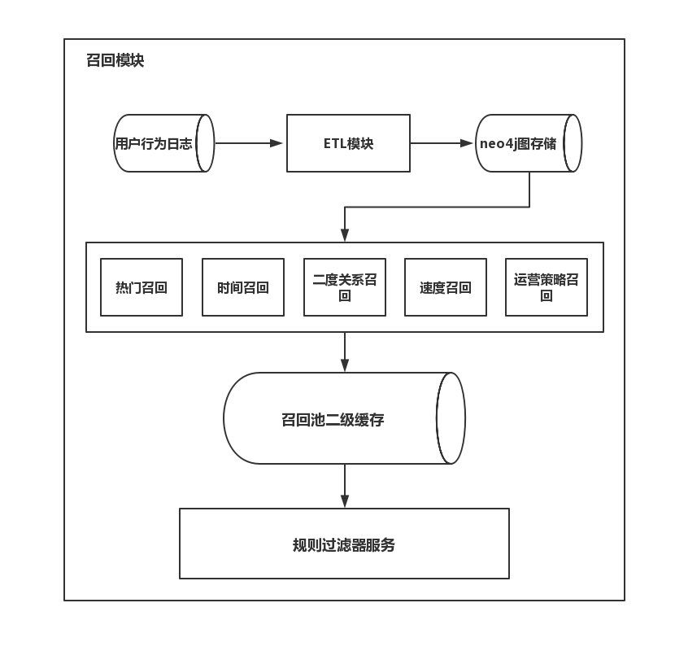

# 2.3 多召回策略

## 学习目标

- 目标
  - 知道多召回策略的设计
- 应用
  - 应用完成用户多召回策略实现

### 2.3.1 召回模块

- 召回模块作用: 针对当前用户尽可能多的覆盖其喜好而进行帖子的筛选。
- 召回模块组成: 召回模块包括, ETL模块, 召回池(包含各种召回策略), 召回池二级缓存, 规则过滤器服务。
- ETL模块计算技术解决方案: 使用AWS弹性云计算服务, 针对海量数据进行处理, 以最小的代价获取和配置计算能力。
- 召回策略计算技术解决方案: 图数据neo4j的内部计算与查询。



### 2.3.2 多召回策略介绍

- 公共召回策略
  - 热门召回: 取当前交互操作得分最多的前n个帖子入召回池
  - 时间召回: 取指定时间段内(一般取最新发布)的前n个帖子入召回池
  - 速度召回: 取单位时间被进行交互操作次数最多的前n个帖子入召回池 
  - 加速度召回: 取单位时间内速度变化（上升）最快的前n个帖子入召回池
  - 协同过滤召回:取与用户隐含向量最相似的n个帖子
  - 明星二度关系召回定义:取与用户隐含向量最相似的n个帖子
  - 随机召回: 随机选择若干帖子
- 个性化召回策略
  - n度关系召回: 图谱中存在基于边的查询, 因此可以使用n度关系进行个性化召回, 最简单的n度关系召回就是基于用户的协同过滤
  - 兴趣召回: 对具有相同的兴趣的用户召回相关的帖子, 这里将用户关注的明星视为其感兴趣的点。
- 自定义召回策略
  - 由产品运营根据产品活动等自定义的召回策略

### 2.3.3 多召回代码实现

#### 2.3.3.1 用户推荐请求

- get_recomm

获取用户推荐结果

```python
@api_view(['GET', 'POST'])
def get_recomm(request):
    IP = request.META.get("HTTP_X_REAL_IP")
    result = r_api._get_recomm(str(IP))
    return HttpResponse(json.dumps(result, ensure_ascii=False))
```

其中都会通过from recomm import api as r_api这个包的相关函数进行推荐，我们推荐逻辑主要都在recomm模块中，这是自定义命名的，当做推荐模块使用。创建一个recomm模块，添加api.py文件


其中_get_recomm的推荐主体逻辑如下

```python
def _get_recomm(IP, uid):
    """推荐全流程"""
    # 1、获取召回数据
    #（1）获得热门召回数据
    hot_data = _get_hot()
    # 获得最近发布召回数据
    last_data = get_last()
    # 获得单位时间内增长速度最快的帖子
    v_data = get_v()
    # 获得基于用户的协同过滤召回数据
    r_data = get_r(uid)
    # 随机召回数据
    random_data = get_random()
    all_data = [hot_data] + [last_data] + [v_data] + [r_data] + [random_data]
    # 进行金字塔规则计算并写入
    # （2）不给召回策略施加任何权重的召回金字塔计算
    j_data = pyramid_array(all_data)
    # 将数据写入金子塔并返回应该推送给规则过滤器的数据
    r_data = j_data_write(uid, j_data)
    # （3）将数据推送给规则规律器做数据内部去重
    # f_data = rfilter(r_data)
    
    # 2、排序部分
    # 根据uid，pid组合特征
    # 根据规则过滤器中的数据索引获得特征
    feature = get_feature_from_neo(r_data)   
    # 特征预处理
    feature = fea_process(feature)
    # 加载模型并对结果排序
    rank_data = model_use(feature)
    return v_get_cache(IP)
```

* 主要流程：获取多个召回结果，进行金字塔规则计算写入，规则过滤器去重，特征预处理，模型排序，写入缓存并推荐出去

目前我们先关注召回的 获取，然后再继续往后讲解

召回连接设置

```python
from neo4j.v1 import GraphDatabase

NEO4J_CONFIG = dict({
    "uri": "bolt://192.168.19.137:7687",
    "auth": ("neo4j", "itcast"),
    "encrypted": False
})

_driver = GraphDatabase.driver(**NEO4J_CONFIG)
```

#### 2.3.3.2公共召回

#### 1、热门召回实现

 热门召回cypher查询：'match(a:SuperfansPost) set a.hot_score = 2\*a.commented_num+a.liked_num+3\*a.forwarded_num return a.pid order by a.hot_score desc limit 100'

* 语句解释：匹配所有的帖子，并且计算每个帖子的热度分数(公式：2\*评论数量+喜欢数量+3\*转发数量)，按照热度分数倒序排序取前100高的帖子ID

```python
def _get_hot():
    """获得热门召回推荐"""
    with _driver.session() as session:
        cypher = "match(a:SuperfansPost) set a.hot_score = 2*a.commented_num+a.liked_num+3*a.forwarded_num return a.pid order by a.hot_score desc limit 100"
        record = session.run(cypher)
        result = list(map(lambda x: x[0], record))
    return result
```

#### 2、时间召回推荐

- 时间召回实现:"match(a:SuperfansPost)  return a.pid order by a.publish_time desc limit 100"
  - cypher语句：查询匹配所有帖子，按照发布时间排序取最早的前100个帖子

```python
def get_last():
    """获得时间召回推荐"""
    with _driver.session() as session:
        cypher = "match(a:SuperfansPost)  return a.pid order by a.publish_time desc limit 100"
        record = session.run(cypher)
        result = list(map(lambda x: x[0], record))
    return result
```

#### 2.3.3.4 速度召回实现

- 速度召回实现:"MATCH (a:SuperfansPost_A) MATCH(b:SuperfansPost) where(a.pid = b.pid) SET b.v=a.hot_score- b.hot_score return b.pid order by b.v desc"
  - 语句解释：SuperfansPost_A代表过去某段时间的帖子信息, 计算他们的热度差值并排序取最高的前100

```python
def get_v():
    """获得速度召回推荐"""
    with _driver.session() as session:
        cypher = "MATCH (a:SuperfansPost_A) MATCH(b:SuperfansPost) where(a.pid = b.pid) SET b.v=a.hot_score- b.hot_score return b.pid order by b.v desc"
        record = session.run(cypher)
        result = list(map(lambda x: x[0], record))
    return result
```

#### 2.3.3.3 个性化召回

#### 1、n度关系召回实现(就是UserCF，用户协同过滤)

n度关系召回实现，个性化召回策略必须传入参数uid, 根据uid进行n度关系的查询, 来召回指定数据。

- n度关系召回实现:"match(a{uid:%d})-[r]-(b:SuperfansPost)-[r2]-(c:SuperfansUser)-[r3]-(d:SuperfansPost) return d.pid limit 100"
  - 语句解释：查询某用户uid发生过行为关系的b个帖子，b个帖子有关系变的c个用户，然后将c个用户他们所发生行为关系的文章d推荐出去100个帖子

```python
def get_r(uid):
    """获得基于用户的帖子二度关系召回"""
    with _driver.session() as session:
        cypher = "match(a{uid:%d})-[r]-(b:SuperfansPost)-[r2]-(c:SuperfansUser)-[r3]-(d:SuperfansPost) return d.pid limit 100" % int(uid)
        record = session.run(cypher)
        result = list(map(lambda x: x[0], record))
    return result
```

#### 2.3.3.5 随机召回

- 随机召回实现:"match(a:SuperfansPost) return a.pid limit 1000"
  - 查询匹配所有帖子取出1000个返回

```python
def get_random():
    """获得运营自定义召回,这里是随机召回"""
    with _driver.session() as session:
        cypher = "match(a:SuperfansPost) return a.pid limit 1000"
        record = session.run(cypher)
        pid_list = list(map(lambda x: x[0], record))
    result = random.sample(pid_list, 20)
    return result
```

#### 2.3.3.4 召回策略设置调整

- 召回策略调整:
  召回策略将不断作出调整和优化, 主要基于推荐成功帖子中各召回策略所占比例, 一般以周为周期, 进行一次调整, 修改占比最小的召回策略。

- 扩展:召回中还可以存在许多使用数据挖掘和机器学习方法的策略, 根据应用本身的属性来定义更多可能相关的用户兴趣, 如影视爱好者, 基于此对用户的签名, 评论内容以及发布内容进行建模, 来扩展召回策略。

### 2.3.4 小结

* 召回模块的流程
* 多种召回策略的定义以及代码实现

