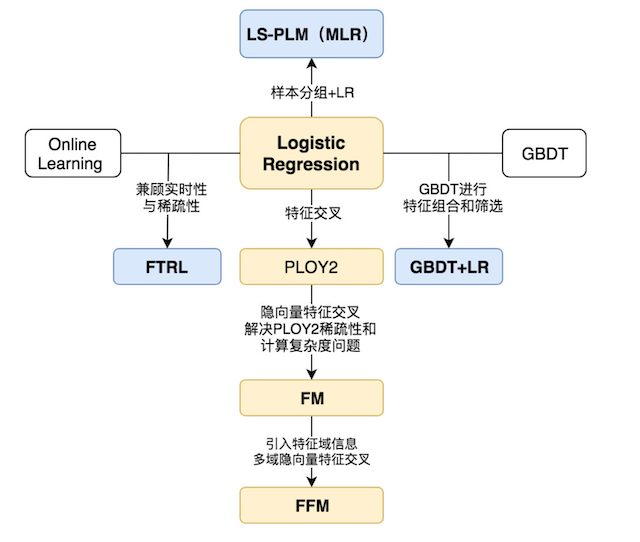
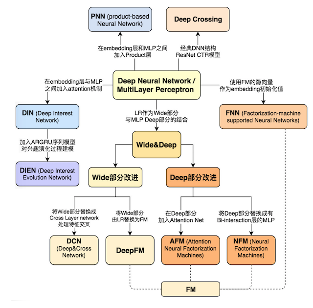
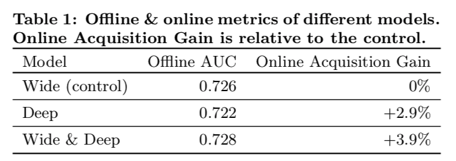
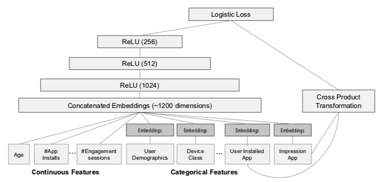
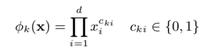

# 3.1 模型选择与原理

## 学习目标

- 目标
  - 了解推荐系统CTR模型的发展历史
  - 说明Wide&Deep模型的结构以及原理
  - 了解TF Wide&Deep模型的接口设置和使用
- 应用
  - 无

### 3.1.1 CTR模型发展历史

#### 3.1.1.1 传统CTR模型发展历史



2012左右之后，各大中小公司的主流CTR模型无一例外全都是LR模型。

- 优点：
  - 1、数学基础：结合CTR模型的问题来说，x就是输入的特征向量，h(x)就是我们最终希望得到的点击率，所以采用LR作为CTR 模型是符合“点击”这一事件的物理意义的。
  - 2、可解释性：LR模型具有极强的可解释性，算法工程师们可以轻易的解释哪些特征比较重要，在CTR模型的预测有偏差的时候，也可以轻易找到哪些因素影响了最后的结果。
  - 3、工程化需要：在GPU尚未流行开来的2012年之前，LR模型也凭借其易于并行化、模型简单、训练开销小等特点占据着工程领域的主流
- 为了解决特征交叉的问题，演化出**PLOY2，FM，FFM**等模型；
- Google从online learning的角度解决模型时效性的问题，提出了**FTRL**

#### 1、POLY2-特征交叉的引入

由于LR仅使用单一特征，无法利用高维信息，只用单一特征进行判断，甚至会得出错误的结论。针对这个问题，当时的算法工程师们经常采用手动组合特征，再通过各种分析手段筛选特征的方法。采用 PLOY2模型进行特征的“暴力”组合成为了可行的选择。

1. 为什么要考虑特征之间的关联信息？

   大量的研究和实际数据分析结果表明：某些特征之间的关联信息（相关度）对事件结果的的发生会产生很大的影响。从实际业务线的广告点击数据分析来看，也正式了这样的结论。

2. 如何表达特征之间的关联？

   表示特征之间的关联，最直接的方法的是构造组合特征。样本中特征之间的关联信息在one-hot编码和浅层学习模型（如LR、SVM）是做不到的。目前工业界主要有两种手段得到组合特征：

   1. 人工特征工程（数据分析＋人工构造）；
   2. 通过模型做组合特征的学习（深度学习方法、FM/FFM方法）

缺点：

- 由于在处理互联网数据时，**经常采用one-hot的方法处理id类数据，致使特征向量极度稀疏，POLY2进行无选择的特征交叉使原本就非常稀疏的特征向量更加稀疏**，使得大部分交叉特征的权重缺乏有效的数据进行训练，无法收敛。

假设一个广告分类的问题，根据用户和广告位相关的特征，预测用户是否点击了广告。元数据如下：

| Clicked? | Country | Day      | Ad_type |
| :------- | :------ | :------- | :------ |
| 1        | USA     | 26/11/15 | Movie   |
| 0        | China   | 1/7/14   | Game    |
| 1        | China   | 19/2/15  | Game    |

“Clicked？”是label，Country、Day、Ad_type是特征。由于三种特征都是categorical类型的，需要经过独热编码（One-Hot Encoding）转换成数值型特征。

| Clicked? | Country=USA | Country=China | Day=26/11/15 | Day=1/7/14 | Day=19/2/15 | Ad_type=Movie | Ad_type=Game |
| :------- | :---------- | :------------ | :----------- | :--------- | :---------- | :------------ | :----------- |
| 1        | 1           | 0             | 1            | 0          | 0           | 1             | 0            |
| 0        | 0           | 1             | 0            | 1          | 0           | 0             | 1            |
| 1        | 0           | 1             | 0            | 0          | 1           | 0             | 1            |

- 权重参数的数量由n直接上升到n^2，极大增加了训练复杂度。
- 特征交叉：
  - 例子：年龄：[1990,2000],[2000,2010]
  - 性别：male, female
  - 交叉特征：male and [1990，2000]，female and [1990，2000] ,male and [2000，2010], female and [2000, 2010]
- 特征交叉问题：如果是简单的进行组合，会造成特征列数量过多，大量特征列。
  - 交叉项中的组合特征参数总共有n*(n−1)/ 2
  - 在数据稀疏性普遍存在的实际应用场景中，交叉项参数的训练是很困难的。

#### 3.1.1.2 深度CTR发展历史



2010年FM被提出，特征交叉的概念被引入CTR模型；2012年MLR在阿里大规模应用，其结构十分接近三层神经网络；2014年Facebook用GBDT处理特征，揭开了特征工程模型化的篇章。这些概念都将在深度学习CTR模型中继续应用，持续发光。

另一边，Alex Krizhevsky 2012年提出了引爆整个深度学习浪潮的AlexNet，深度学习的大幕正式拉开，其应用逐渐从图像扩展到语音，再到NLP领域，推荐和广告也必然会紧随其后，投入深度学习的大潮之中。

2016年，随着FNN，Deep&Wide，Deep crossing等一大批优秀的CTR模型框架的提出，深度学习CTR模型逐渐席卷了推荐和广告领域，成为新一代CTR模型当之无愧的主流。

我们在学习使用一些广告、推荐领域流行的深度学习CTR模型的结构特点时候。应当选择模型的标准尽量遵循下面三个原则：

* 1.模型的在业界影响力较大的
* 2.已经被Google，微软，阿里等知名互联网公司成功应用的
* 3.工程导向的，而不是仅用实验数据验证或学术创新用的

### 3.1.2 Wide&deep论文核心剖析

#### 3.1.2.1 WDL论文使用场景

* Google Wide&Deep（2016年）：[Wide & Deep Learning for Recommender Systems ](https://arxiv.org/pdf/1606.07792.pdf)

  Heng-Tze Cheng, Levent Koc, Jeremiah Harmsen, Tal Shaked, Tushar Chandra, 

  Hrishi Aradhye, Glen Anderson, Greg Corrado, Wei Chai, Mustafa Ispir, Rohan Anil, 

  Zakaria Haque, Lichan Hong, Vihan Jain, Xiaobing Liu, Hemal Shah 

* 场景：Google Play，一款移动APP应用商店，关注应用的推荐问题

  - 10亿活跃用户，超100万应用APP

* 模型训练：

  - 超500 Billion=5000亿的样本数据

* 效果显示：3周的线上A/B实验,实践表明wide&deep框架显著提高了移动app score 的app下载率



#### 3.1.2.2 为什么选择WDL

* 1、WDL，更好的解决了Memorization和Generalization的平衡问题（翻译成记忆与泛化(还有其他一些中文翻译，但这是最合适的)）

**Memorization:**

面对拥有大规模离散sparse特征的CTR预估问题时，将特征进行非线性转换，然后再使用线性模型是在业界非常普遍的做法，最流行的即LR+特征叉乘，Memorization 通过一系列**人工的特征叉乘（cross-product）**来构造这些非线性特征，捕捉sparse特征之间的高阶相关性。

Memorization的缺点是：1、需要更多的人工设计；2、可能出现过拟合;3、无法捕捉训练数据中未曾出现过的特征对

> One limitation of cross-product trans- formations is that they do not generalize to query-item fea- ture pairs that have not appeared in the training data.

**Generalization**

Generalization会学习新的特征组合，优点是更少的人工参与，对历史上没有出现的特征组合有更好的泛化性。在数学理论中可以拟合任何高阶形式的非线性函数,  满足推荐系统对多样性的要求。

* 2、模型结构简单，容易理解和调优
* 3、已广泛应用于各个领域，其中Google Play成功提高应用下载率，作为其他论文改进的基础

#### 3.1.2.3 WDL论文贡献

* 论文的主要贡献：
  * **通用于具有稀疏输入的推荐系统的wide&deep框架，联合训练带有嵌入的前馈神经网络和带有特征变换的线形模型**
  * The Wide & Deep learning framework for jointly train-ing feed-forward neural networks with embeddings and linear model with feature transformations for generic recommender systems with sparse inputs. 
  * **在Google Play上实施的Wide＆Deep推荐系统的实施和评估，Google Play是一个拥有超过10亿活跃用户和超过100万个应用的移动应用商店**
  * The implementation and evaluation of the Wide & Deep recommender system productionized on Google Play, a mobile app store with over one billion active users and over one million apps. 
  * **开源了基于Tensorflow的高级API的实现**
  * We have open-sourced our implementation along with a high-level API in TensorFlow 

#### 3.1.2.4 模型结构

模型包含Wide和Deep两个部分(LR+DNN的结合)



#### 1 Wide模型

Wide模型就是一个广义线性模型,根据人工经验、业务背景，将我们认为有价值的、显而易见的特征及特征组合，喂入Wide侧。模型如下：

$$
y=\mathbf{w}^T\mathbf{x}+b
$$
注：y是预测结果，$$X = [x_1,x_2,,x_d]$$d个特征组成的向量，$$W=[w_1,w_2,,w_d]$$模型的权重参数以及偏置$$b$$

* 最终要的特征的输入变化就是 交叉特征



理解：For binary features, a cross-product transformation (e.g.“AND(gender=female, language=en)”) is 1 if and only if the constituent features (“gender=female” and “language=en”) are all 1, and 0 otherwise. 

> Wide部分只用了一组特征叉乘，即被推荐的app ☓ 用户下载的app。作者为什么这么做呢？结合业务思考，在Google Play商店的app下载中，不断有新的app推出，并且有很多“非常冷门、小众”的app，而现在的智能手机user几乎全部会安装一系列必要的app。这时Wide可以发挥了它“记忆”的优势，作者在这里选择了“记忆”user下载的app与被推荐的app之间的相关性，有点类似“装个这个app后还可能会装什么”

Wide模型参考Memorization解决记忆问题。

#### 2 Deep模型

* Deep模型是一个前馈神经网络(MLP)：论文中为三层：1024，512，256

$$
a^{\left ( l+1 \right )}=f\left ( W^{\left ( l \right )}a^{(l)}+b^{\left ( l \right )} \right )
$$

l为具体第几层网络，f为激活函数,通常定位 (ReLUs)

* 默认使用relu, 相比sigmoid能有有效防止梯度消失，并且计算量相比sigmoid小，有助于模型快速收敛。使用relu函数时应注意: 学习率应该设置小一些, 防止出现“死节点”, 简单解释一下"死节点", 即由于relu函数特点， 当输入<0时, 输出为0, 不会产生任何激活作用

$$
a(l),b(l),W (l)
$$

上述参数第$$l$$层输如激活值， 偏置和模型权重值

* 对于输入的特征处理：连续型：归一化到CDF；离散型：特征向量

离散型特征：

> The dimensionality of the embeddings are usually on the order of O(10) to O(100). The embedding vectors are initialized ran-domly and then the values are trained to minimize the final loss function during model training. These low-dimensional dense embedding vectors are then fed into the hidden layers of a neural network in the forward pass. Specifically, each hidden layer performs the following computation:

每个特征进行随机初始化embedding向量通常维度为10~100，并在模型的训练过程中逐渐修改该向量的值，即将向量作为参数参与模型的训练

连续型特征：通过CDF被归一化到 [0,1] 之间

> 原论文中，Categorical 特征映射到32维embeddings，和原始Continuous特征共1200维作为NN输入。

Deep模型参考Generation解决泛化问题

#### 3 WDL的联合训练(Joint Training)

联合训练是指同时训练Wide模型和Deep模型，并将两个模型的结果的加权和作为最终的预测结果。联合训练（Joint Training）和集成（Ensemble）是不同的，集成是每个模型单独训练，再将模型的结果汇合。相比联合训练，集成的每个独立模型都得学得足够好才有利于随后的汇合，因此每个模型的model size也相对更大。而联合训练的wide部分只需要作一小部分的特征叉乘来弥补deep部分的不足，不需要 一个full-size 的wide 模型。

$$
P\left ( Y=1\mid \mathbf{x} \right )=\sigma \left ( \mathbf{w}_{wide}^T\left [ \mathbf{x},\phi \left ( \mathbf{x} \right ) \right ] + \mathbf{w}_{deep}^Ta^{\left ( l_f \right )}+b \right )
$$
训练的方法：

* 损失函数: 二分类交叉熵损失也叫逻辑损失(logistic loss)

- Wide模型：FTRL
- Deep模型：AdaGrad

#### 问题1：什么是FTRL？为什么用FTRL？解决什么问题？

> 冲突：最优化求解问题可能是我们在工作中遇到的最多的一类问题了:从已有的数据中􏰁炼出最适合的模型参数，从而对未知的数据进行预测。当我们面对高维高数据量的场景时，常见的批量处理的方式已经显得力不从心，需要有在线优化算法的方法来解决此类问题。

* FTRL（Follow the Regularized Leader）算法，它由Google的H. Brendan McMahan在2010年提出.一种在线优化算法
  * 为什么使用FTRL：使用正则化和梯度截断的方式更容易获得稀疏解

* 稀疏解的重要性: 在特征维度极高的大规模数据下, 稀疏解能有效降低模型复杂度, 防止模型过拟合; 并减小模型预测时占用内存大小, 有助于提升QPS。

$$
w_{t+1} = argminw(\hat{g}{1:t}w + L1||w||_1 + L2||w||_2^2)
$$

注意：在2011年论文的公式中并没有正则化，但是在其2013年发表的FTRL工程化实现的论文中却使用到了L2正则项。但是该项的引入并不影响FRTL 的稀疏性，L2正则项的引入仅仅相当于对最优化过程多了一 个约束，使得结果求解结果更加“平滑”。 

TensorFlow API：tf.train.FtrlOptimizer

```python
__init__(
    learning_rate,
    learning_rate_power=-0.5,
    initial_accumulator_value=0.1,
    l1_regularization_strength=0.0,
    l2_regularization_strength=0.0,
    use_locking=False,
    name='Ftrl',
    accum_name=None,
    linear_name=None,
  	# 这与上面的L2不同之处在于上面的L2是稳定性惩罚，而这种L2收缩是一个幅度惩罚
    l2_shrinkage_regularization_strength=0.0
)
```

#### 问题2：为什么使用AdaGrad？

深度学习模型中往往涉及大量的参数，不同参数的更新频率往往有所区别。对于更新不频繁的参数（典型例子：更新 word embedding 中的低频词），我们希望单次步长更大，多学习一些知识；对于更新频繁的参数，我们则希望步长较小，使得学习到的参数更稳定，不至于被单个样本影响太多。因此，Adagrad非常适合处理稀疏数据。

AdaGrad优化算法特点：'引入二阶动量'，根据自变量在每个维度的梯度值的大小来调整各个维度上的学习率，从而避免统一的学习率难以适应所有维度的问题。
$$
\theta_{t+1} = \theta_{t} - \dfrac{\eta}{\sqrt{G_{t} + \epsilon}} \odot g_{t}
$$

> Adagrad的主要好处之一是它不需要手动调整学习率。 大多数实现使用默认值0.01并保留它。主要弱点是它在分母中积累了平方梯度：由于每个附加项都是正数，因此累积总和在训练期间不断增长。 这反过来导致学习率缩小过快，训练很快停止。Adagrad会累加之前所有的梯度平方，而RMSprop等算法仅仅是移动平滑处理计算对应的平均值，因此可缓解Adagrad算法学习率下降较快的问题。（AdaGrad算法、RMSProp算法以及AdaDelta算法一样，目标函数自变量中每个元素都分别拥有自己的学习率）

#### 4 评价标准

Google应用场景中度量的指标有两个，分别针对在线的度量和离线的度量，在线时，通过A/B test，最终利用安装率（Acquisition）；离线则使用AUC作为评价模型的指标

### 3.1.3 WDL 模型实现源码讲解

- tf.estimator.DNNLinearCombinedClassifier()：
  - model_dir: 保存模型参数、图等。如checkponits文件路径
  - linear_feature_columns: 线性特征列, wide模型需要输入的特征
  - linear_optimizer: 针对线性wide模型损失函数选择的优化器, 默认FTRL optimizer，可选(one of 'Adagrad', 'Adam', 'Ftrl', 'RMSProp', 'SGD')
  - dnn_feature_columns: DNN特征列, deep模型需要输入的特征
  - dnn_optimizer: 针对DNN模型损失函数选择的优化器, 这里默认使用'Adagrad'
  - dnn_hidden_units: DNN每层神经元数列表
  - dnn_activation_fn: DNN激活函数，默认使用RELU
  - dnn_dropout:模型训练中隐藏层单元的 drop_out 比例
  - n_classes: 分类数，默认是二分类，>2 则进行多分类
  - weight_column: 用于增强/降低某列的权重, 该列会被执行weight_column.normalizer_fn函数
  - label_vocabulary: 目标标签类别，如果给参数提供类别字符串列表，如果没提供默认[0, 1,…, n_classes -1]
  - warm_start_from: 模型热启动的checkpoint文件路径, 设置后模型将使用checkpoint数据进行权重初始化
  - loss_reduction: loss减小的表示方式
  - batch_norm: 每个隐藏层是否使用批标准化
  - linear_sparse_combiner: 如果线性模型中某些类别特征是"多元"的, 该多元特征将在最后时计算其对应的单一权重，将对其所有元权重做改种方式的处理，以便缩小线性模型的规格
  - config: RunConfig对象, 其中将写入运行时必要配置
  - input_layer_partitioner: 输入层分区, 这是一项与分布式计算有关的参数, 用于指明对输入层进行切片的方式 

```python
class DNNLinearCombinedClassifier(estimator.Estimator):
  __doc__ = DNNLinearCombinedClassifierV2.__doc__.replace(
      'SUM_OVER_BATCH_SIZE', 'SUM')

  def __init__(self,
               model_dir=None,
               linear_feature_columns=None,
               linear_optimizer='Ftrl',
               dnn_feature_columns=None,
               dnn_optimizer='Adagrad',
               dnn_hidden_units=None,
               dnn_activation_fn=nn.relu,
               dnn_dropout=None,
               n_classes=2,
               weight_column=None,
               label_vocabulary=None,
               input_layer_partitioner=None,
               config=None,
               warm_start_from=None,
               loss_reduction=losses.Reduction.SUM,
               batch_norm=False,
               linear_sparse_combiner='sum'):
    self._feature_columns = _validate_feature_columns(
        linear_feature_columns=linear_feature_columns,
        dnn_feature_columns=dnn_feature_columns)

    head = head_lib._binary_logistic_or_multi_class_head(  # pylint: disable=protected-access
        n_classes, weight_column, label_vocabulary, loss_reduction)

    def _model_fn(features, labels, mode, config):
      """Call the _dnn_linear_combined_model_fn."""
      return _dnn_linear_combined_model_fn(
          features=features,
          labels=labels,
          mode=mode,
          head=head,
          linear_feature_columns=linear_feature_columns,
          linear_optimizer=linear_optimizer,
          dnn_feature_columns=dnn_feature_columns,
          dnn_optimizer=dnn_optimizer,
          dnn_hidden_units=dnn_hidden_units,
          dnn_activation_fn=dnn_activation_fn,
          dnn_dropout=dnn_dropout,
          input_layer_partitioner=input_layer_partitioner,
          config=config,
          batch_norm=batch_norm,
          linear_sparse_combiner=linear_sparse_combiner)

    super(DNNLinearCombinedClassifier, self).__init__(
        model_fn=_model_fn,
        model_dir=model_dir,
        config=config,
        warm_start_from=warm_start_from)
```

注：源码地址 [tf.estimator.DNNLinearCombinedClassifier()]( https://github.com/tensorflow/estimator/blob/master/tensorflow_estimator/python/estimator/canned/dnn_linear_combined.py)

#### 3.1.3.1 模型源码解释

源码使用tf.estimator.Estimator高阶API类型实现的Wide&Deep模型。Estimator允许开发者自定义任意的模型结构、损失函数、优化方法以及如何对这个模型进行训练、评估和导出等内容，同时屏蔽了与底层硬件设备、分布式网络数据传输等相关的细节。

* 1、model_fn

由于TF的自实现DNNLinearCombinedClassifier是继承estimator.Estimator类型，所以需要有model_fn函数提供给估计器。如head, labels,mode,features,optimizer等等

```
def _model_fn(features, labels, mode, config):
      """Call the _dnn_linear_combined_model_fn."""
      return _dnn_linear_combined_model_fn(
          features=features,
          labels=labels,
          mode=mode,
          head=head,
          linear_feature_columns=linear_feature_columns,
          linear_optimizer=linear_optimizer,
          dnn_feature_columns=dnn_feature_columns,
          dnn_optimizer=dnn_optimizer,
          dnn_hidden_units=dnn_hidden_units,
          dnn_activation_fn=dnn_activation_fn,
          dnn_dropout=dnn_dropout,
          input_layer_partitioner=input_layer_partitioner,
          config=config,
          batch_norm=batch_norm,
          linear_sparse_combiner=linear_sparse_combiner)
```

* 3、head_lib._binary_logistic_or_multi_class_head
  * 创建二分类，或者多分类head
  * BinaryClassHead: 二分类 Head Class，定义损失类型
    * 包括使用sigmoid_cross_entropy_with_logits进行创建损失
  * MultiClassHead：多分类Head Class，
    * 包括sparse_softmax_cross_entropy创建损失

**Head API**对网络最后一个隐藏层之后的部分进行了抽象，它的主要设计目标是简化模型函数（model_fn）的编写。Head知道如何计算损失（loss）、评估度量标准（metric)、预测结果（prediction）。为了支持不同的模型，Head接受logits和labels作为参数，并生成表示loss、metric和prediction的张量。有时为了避免计算完整的logit张量，Head也接受最后一个隐藏的激活值作为输入。

Head的使用API如下，通常会提供Estimator中head参数，**可以简化model_fn的编写**

```python
def model_fn(features, target, mode, params)
  predictions = tf.stack(tf.fully_connected, [50, 50, 10])
  loss = tf.losses.sparse_softmax_cross_entropy(target, predictions)
  train_op = tf.train.create_train_op(
    loss, tf.train.get_global_step(),
    params[’learning_rate’], params[’optimizer’])
  return EstimatorSpec(mode=mode,
                       predictions=predictions,
                       loss=loss,
                       train_op=train_op)


def model_fn(features, target, mode, params):
  last_layer = tf.stack(tf.fully_connected, [50, 50])
  head = tf.multi_class_head(n_classes=10)
  return head.create_estimator_spec(
    features, mode, last_layer,
    label=target,
    train_op_fn=lambda loss: my_optimizer.minimize(loss, tf.train.get_global_step())
```

### 3.1.4 Wide&Deep API使用

tf.estimator.DNNLinearCombinedClassifier会结合tf.feature_column与tf.data进行使用

```python
# 指定列特征
a = tf.feature_column.categorical_column_with_identity('a', num_buckets=25)

b = tf.feature_column.numeric_column('b')
c = tf.feature_column.numeric_column('c', shape=)
d = tf.feature_column.numeric_column('d')

# wide侧
wide_columns = [a]

# deep侧
deep_columns = [
    tf.feature_column.embedding_column(a, dimension=25),
    b,
    c,
    d
]

# 构造模型
estimator = tf.estimator.DNNLinearCombinedClassifier(model_dir="./tmp/ckpt/...",
                                                     linear_feature_columns=wide_columns,
                                                     dnn_feature_columns=deep_columns,
                                                     dnn_hidden_units=[256, 128, 64])
# 输入训练与验证数据集进行模型训练，评估
# input_fn返回dataset类型数据，指定了Batch，epoch大小
estimator.train(input_fn=input_fn)
res = estimator.evaluate(input_fn=input_fn)
```

### 3.1.5 小结

* 推荐系统CTR模型发展历史
* Wide&Deep模型的结构以及原理
  * Wide结构
  * Deep结构
  * 损失函数、优化算法
    * Wide模型：FTRL
    * Deep模型：AdaGrad
* TF Wide&Deep模型的接口设置和使用


