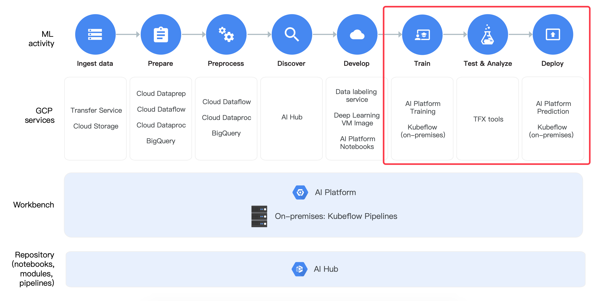
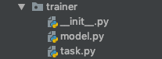
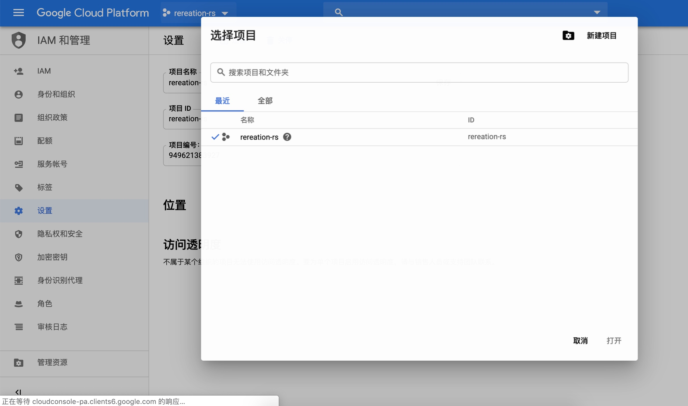
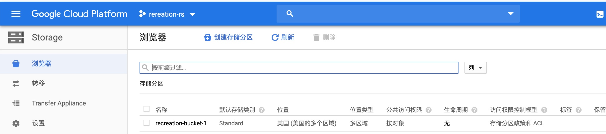
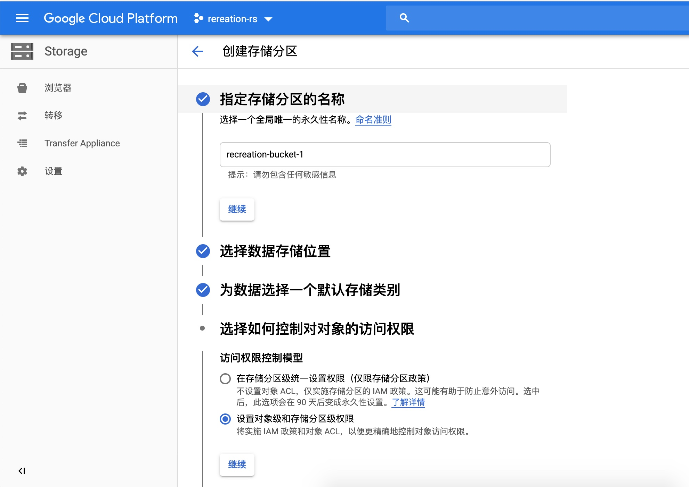
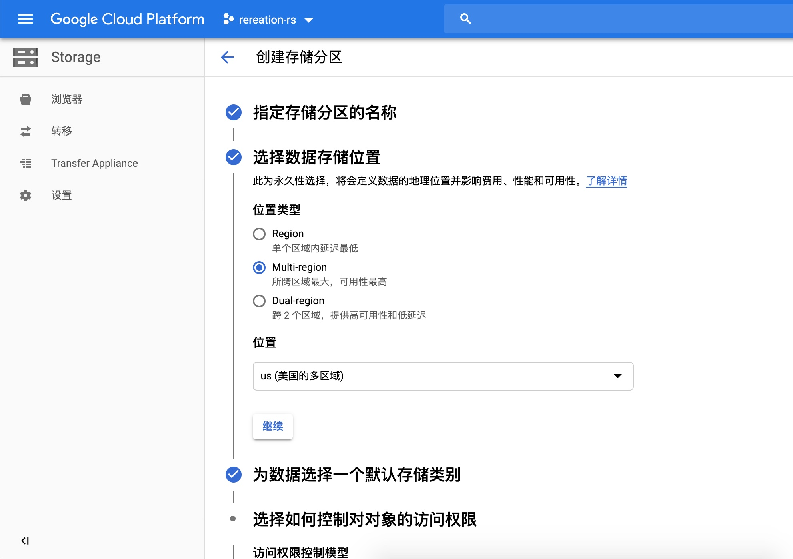
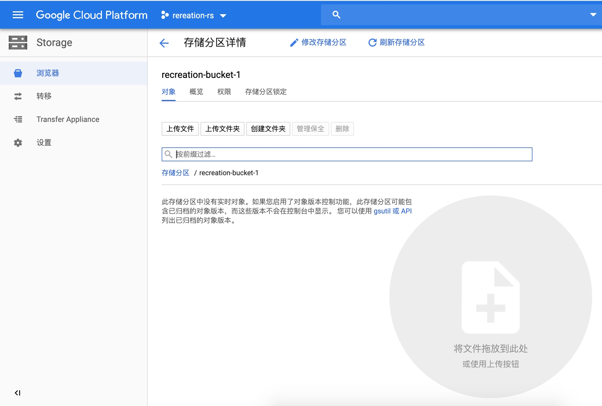

# 3.3 GCP模型训练与模型参数调优

## 学习目标

- 目标
  - 了解GCP平台的模型训练过程
  - 说明超参数调优过程
- 应用
  - 应用完成泛娱乐Wide&Deep模型的训练

### 3.3.1 **Cloud AI Platform**模型训练

**GCP平台产品之一 Cloud Machine Learning Engine（已更名AI Platform） 是一项托管式服务，能让开发者和数据科学家构建卓越的机器学习模型并在生产环境中运行。**Cloud ML Engine 提供训练和预测服务，这些服务可以一起使用，也可以单独使用。我们在这里选择在谷歌云平台上进行模型训练与参数调优。主要选择原因如下

* 提供一套完整的生产环境平台，方便开发者快速训练部署上线模型服务
* 对于小型公司受制于GPU/TPU的成本限制，能够提升机器学习的算力水平，节省成本，同时也避免的搭建多GPU或者分布式训练平台的底层繁琐的构建过程

#### 特性

* 自定义容器支持

  除了对 TensorFlow 等流行框架的原生支持外，您还可以在 Cloud ML Engine 上运行任何其他框架。您只需上传带有训练程序的 Docker 容器，Cloud ML Engine 便会让其在 Google 的基础架构上开始工作。

* 分布式训练

  有时，您的数据和模型太过庞大，一台机器无法及时完成工作。幸运的是，Cloud ML Engine 会自动设置一个环境，让 XGBoost 和 TensorFlow 在多台机器上运行，因此您可以向训练作业添加多个 GPU 或将其拆分到多个虚拟机中，以此获得所需的速度。

* 自动预配资源

  Cloud ML Engine 是一项托管式服务，可自动预配和监控所有资源；可使用支持 CPU、GPU 和 TPU 的分布式托管训练基础架构来构建模型；并可通过在多个节点上进行训练或并发运行多个实验来加速模型开发。因此，您可以专注于模型开发和部署，而无需担心基础架构问题。

* HyperTune

  使用 HyperTune 自动调整深度学习超参数，以更快地获得更好的结果。数据科学家经常需要在云端管理数千项调整实验。HyperTune 可以为您省去大量单调乏味且容易出错的工作。

* 可移植的模型

  利用开源 TensorFlow SDK 或其他受支持的机器学习框架，在本地基于示例数据集来训练模型，并使用 Google Cloud Platform 开展大规模训练。使用 Cloud ML Engine 训练的模型可以下载到本地运行或用于移动平台集成。您还可以导入在任何地方训练过的 scikit-learn、XGBoost、Keras 和 TensorFlow 模型，以用于全托管式实时预测，而无需 Docker 容器。

* 服务器端预处理

  使用 scikit-learn 流水线和 tf.transform 将部署预处理工作推送到 Google Cloud。这意味着您可以将原始数据发送到生产环境中的模型并减少本地计算，同时还可以防止因在训练和预测中采用了不同的预处理方式而引发数据倾斜。

#### 流程

下面这个图就说明**Cloud Machine Learning Engine**的流程；



* 训练：使用AI platform训练
* 训练的模型测试分析：使用TFX tools工具
* 部署：AI platform平台提供部署

### 3.3.2 Cloud ML Engine平台使用

可以在 GCP 内的无服务器环境中使用 Cloud ML Engine 训练服务来扩大模型训练规模。Cloud ML Engine 支持流行的机器学习框架，也允许 Docker 映像中运行应用。使用Cloud ML Engine构建训练分为三步

* 目的：提交一份Wide&Deep的模型训练工作到的谷歌云的ML Engine进行训练
* 步骤：
  * 1、Python代码打包
  * 2、提交训练任务到云端（配置Google Cloud SDK环境、提交命令等）
    * 1、安装Google Cloud SDK，配置本地关联远程谷歌GCP账号、项目等
    * 2、远端创建分区，本地上传wide&deep模型训练数据到分区
    * 3、Google Cloud 训练任务提交到远程GCP平台
  * 3、task运行代码实现

#### 3.3.2.1 Python代码打包

创建一个trainer文件夹，下面添加两个文件\_\_init\__.py,以及一个task.py。这个包名叫做trainer.task。并且同时将我们之前的WDL模型放入trainer目录下



#### 3.3.2.2 提交训练任务到云端

#### 1、条件-安装Google Cloud SDK

Google Cloud SDK 这套工具可用于管理托管在 Google Cloud Platform 上的资源和应用，其中的工具包括 gcloud、gsutil和 bq命令行工具。gcloud 命令行工具随 Cloud SDK 一并下载；如需查看 gcloud CLI 的综合指南，请参阅 [gcloud 命令行工具概览](https://cloud.google.com/sdk/gcloud)。安装地址: https://cloud.google.com/sdk/docs/，下载安装之后可以使用gcloud命令

> 注意：**由于gdk要与远程GCP平台关联，**
>
> **(1) 所以前提需要在centos安装shadowsocks客户端并配置好账号密码**
>
> **(2) GCP平台创建一个项目：rereation-rs（名称可以修改，后面会用）**
>
> 
>
> **紧接着做以下操作：**

```python
gcloud config set proxy/type socks5
gcloud config set proxy/address 127.0.0.1
gcloud config set proxy/port 1080
gcloud init --console-only
```

然后进行一次输入需要关联到远程的工程以及账号

```python
[root@hadoop-master google-cloud-sdk]# gcloud init --console-only
Welcome! This command will take you through the configuration of gcloud.

Settings from your current configuration [default] are:
core:
  disable_usage_reporting: 'False'
proxy:
  address: 127.0.0.1
  password: None
  port: '1085'
  type: socks5

Pick configuration to use:
 [1] Re-initialize this configuration [default] with new settings 
 [2] Create a new configuration
Please enter your numeric choice:  1
...
You must log in to continue. Would you like to log in (Y/n)?  y

Go to the following link in your browser:

https://accounts.google.com/o/oauth2/auth?redirect_uri=urn%3Aietf%3Awg%3Aoauth%3A2.0%3Aoob&prompt=select_account&response_type=code&client_id=32555940559.apps.googleusercontent.com&scope=https%3A%2F%2Fwww.googleapis.com%2Fauth%2Fuserinfo.email+https%3A%2F%2Fwww.googleapis.com%2Fauth%2Fcloud-platform+https%3A%2F%2Fwww.googleapis.com%2Fauth%2Fappengine.admin+https%3A%2F%2Fwww.googleapis.com%2Fauth%2Fcompute+https%3A%2F%2Fwww.googleapis.com%2Fauth%2Faccounts.reauth&access_type=offline


Enter verification code: 4/qwE_E-QxBpEZsym-OQhMRheVthATyLcIRPApYMFWfgVcRVVi6-kJhAY
You are logged in as: [benjamin.huxinghui@gmail.com].

Pick cloud project to use: 
 [1] rereation-rs # GCP平台远程已经创建的项目
 [2] Create a new project
Please enter numeric choice or text value (must exactly match list 
item):  1

Your current project has been set to: [rereation-rs].
...
Do you want to configure a default Compute Region and Zone? (Y/n)?  y

Which Google Compute Engine zone would you like to use as project 
default?
If you do not specify a zone via a command line flag while working 
with Compute Engine resources, the default is assumed.
 [1] us-east1-b
 [2] us-east1-c
 [3] us-east1-d
 [4] us-east4-c
 [5] us-east4-b
 [6] us-east4-a
 [7] us-central1-c
 [8] us-central1-a
 ...
 [44] asia-east2-a
 [45] asia-east2-b
 [46] asia-east2-c
 [47] asia-northeast2-a
 [48] asia-northeast2-b
 [49] asia-northeast2-c
 [50] europe-north1-a
Did not print [12] options.
Too many options [62]. Enter "list" at prompt to print choices fully.
Please enter numeric choice or text value (must exactly match list 
item):  8

* Run `gcloud --help` to see the Cloud Platform services you can interact with. And run `gcloud help COMMAND` to get help on any gcloud command.
* Run `gcloud topic --help` to learn about advanced features of the SDK like arg files and output formatting
```

配置好shadosocks、邮箱信息、远程项目信息

```python
# 查看配置好的信息显示如下
(recreation) [root@hadoop-master model]# gcloud config list
[compute]
region = us-central1
zone = us-central1-a
[core]
account = benjamin.huxinghui@gmail.com
disable_usage_reporting = False
project = rereation-rs
[proxy]
address = 127.0.0.1
password = None
port = 1085
type = socks5

Your active configuration is: [default]
```

####2、为存储训练数据和训练后的模型的空间，需要在GCP平台设置存储分区

远端平台创建分区效果：



远端创建过程1：取名字recreation-bucket-1







在本地需要指定两个变量

```python
BUCKET_NAME="recreation-bucket-1"
```

* 准备数据：将Wide&Deep的训练数据传入云端分区

```powershell
(recreation) [root@hadoop-master model]# gsutil cp -r ./test_data.csv gs://$BUCKET_NAME/data
(recreation) [root@hadoop-master model]# gsutil cp -r ./train_data.csv gs://$BUCKET_NAME/data
```

#### 3、Cloud ML Engine命令提交任务

提交任务需要用到 `gcloud` 命令行工具

```python
gcloud ai-platform jobs submit training JOB [--config=CONFIG] [--job-dir=JOB_DIR] [--labels=[KEY=VALUE,…]] [--master-accelerator=[count=COUNT],[type=TYPE]] [--master-image-uri=MASTER_IMAGE_URI] [--master-machine-type=MASTER_MACHINE_TYPE] [--module-name=MODULE_NAME] [--package-path=PACKAGE_PATH] [--packages=[PACKAGE,…]] [--parameter-server-accelerator=[count=COUNT],[type=TYPE]] [--parameter-server-image-uri=PARAMETER_SERVER_IMAGE_URI] [--python-version=PYTHON_VERSION] [--region=REGION] [--runtime-version=RUNTIME_VERSION] [--scale-tier=SCALE_TIER] [--staging-bucket=STAGING_BUCKET] [--worker-accelerator=[count=COUNT],[type=TYPE]] [--worker-image-uri=WORKER_IMAGE_URI] [--async     | --stream-logs] [--parameter-server-count=PARAMETER_SERVER_COUNT --parameter-server-machine-type=PARAMETER_SERVER_MACHINE_TYPE] [--worker-count=WORKER_COUNT --worker-machine-type=WORKER_MACHINE_TYPE] [GCLOUD_WIDE_FLAG …] [-- USER_ARGS …]
```

这个命令还有一个等价的 REST API 调用方式。声明要提交的作业，指定相关参数

这时候终于可以跑训练任务了。对于每次训练或者预测，都要取一个专门的名称标识。

```python
JOB_NAME=wide_deep_job
```

* gcloud ai-platform jobs submit training $JOB_NAME
  * 作用：向谷歌云计算机器学习引擎提交训练任务，并要求将工作命名为要求打印流式日志要求工作结果输出路径   
  * **JOB_NAME**: 后面是任务的名称（唯一标识任务的名称，不可以和之前提交的任务名重复）
  * **module-name**: 模块名称trainer.task, task就是你程序的入口python文件，在标准项目结构中叫做task.py的那个文件,trainer为标准项目结构中trainer文件夹
  * **staging-bucket**: 为google cloud上的路径，指定你把你的代码文件上传到哪在运行程序的时候可以在那个路径上找到你的源码
  * **package-path**:为你本地到trainer文件夹的路径，也就是你把trainer文件夹存在了本地的什么位置
  * [--job-dir=JOB_DIR] 
  * **job-dir** :指定输出地址,就是指定tensorflow代码在训练过程中生成的文件
  * **python-version**：要求python的版本 3.5 （默认为2.7, 要求3.5时必须ML-engine版本>=1.4）
  * **runtime-version**:最新版本为1.6，支持python 3
  * **region**:定位计算引擎所在的可用区域

```python
BUCKET_NAME="recreation-bucket-1"
TRAIN_DATA=gs://$BUCKET_NAME/data/train_data.csv
EVAL_DATA=gs://$BUCKET_NAME/data/test_data.csv
OUTPUT_PATH=gs://$BUCKET_NAME/$JOB_NAME
REGION=us-central1
gcloud ml-engine jobs submit training $JOB_NAME --stream-logs --job-dir $OUTPUT_PATH --runtime-version 1.8 --python-version 3.5 --module-name trainer.task --package-path trainer/ --region $REGION --scale-tier STANDARD_1
```

#### 3.3.2.3 task运行代码实现

**命令行参数获取**

* from tensorflow.contrib.training.python.training import hparam：用于构造参数hparam传入模型
* import argparse：用于获取命令参数

```python
 import argparse
 import json
 import os
 import tensorflow as tf
 import trainer.model as model
 
 
 if __name__ == '__main__':
   parser = argparse.ArgumentParser()
   # 输入参数指定，提供解释以及默认值
   parser.add_argument(
       '--train-files',
       help='GCS file or local paths to training data',
       nargs='+',
       default='gs://recreation-bucket-1/data/train_data.csv')
   parser.add_argument(
       '--eval-files',
       help='GCS file or local paths to evaluation data',
       nargs='+',
       default='gs://recreation-bucket-1/data/test_data.csv')
   parser.add_argument(
       '--job-dir',
       help='GCS location to write checkpoints and export models',
       default='gs://recreation-bucket-1/wide_deep_job/')
   parser.add_argument(
       '--num-epochs',
       help="""\
       Maximum number of training data epochs on which to train.
       If both --max-steps and --num-epochs are specified,
       the training job will run for --max-steps or --num-epochs,
       whichever occurs first. If unspecified will run for --max-steps.\
       """,
       type=int)
   parser.add_argument(
       '--train-batch-size',
       help='Batch size for training steps',
       type=int,
       default=64)
   parser.add_argument(
       '--eval-batch-size',
       help='Batch size for evaluation steps',
       type=int,
       default=64)
   parser.add_argument(
       '--embedding-size',
       help='Number of embedding dimensions for categorical columns',
       default=8,
       type=int)
   parser.add_argument(
       '--first-layer-size',
       help='Number of nodes in the first layer of the DNN',
       default=100,
       type=int)
   parser.add_argument(
       '--num-layers', help='Number of layers in the DNN', default=4, type=int)
   parser.add_argument(
       '--scale-factor',
       help='How quickly should the size of the layers in the DNN decay',
       default=0.7,
       type=float)
   parser.add_argument(
       '--train-steps',
       help="""\
       Steps to run the training job for. If --num-epochs is not specified,
       this must be. Otherwise the training job will run indefinitely.\
       """,
       default=100,
       type=int)
   parser.add_argument(
       '--eval-steps',
       help='Number of steps to run evalution for at each checkpoint',
       default=100,
       type=int)
   parser.add_argument(
       '--export-format',
       help='The input format of the exported SavedModel binary',
       choices=['JSON', 'CSV', 'EXAMPLE'],
       default='JSON')
   parser.add_argument(
       '--verbosity',
       choices=['DEBUG', 'ERROR', 'FATAL', 'INFO', 'WARN'],
       default='INFO')
 
   args, _ = parser.parse_known_args()
 
   # 设置日志打印级别
   tf.logging.set_verbosity(args.verbosity)
   # 设置图运行日志级别
   os.environ['TF_CPP_MIN_LOG_LEVEL'] = str(
       tf.logging.__dict__[args.verbosity] / 10)
 
   # 获取参数，运行训练任务
   hparams = hparam.HParams(**args.__dict__)
   train_and_evaluate(hparams)
```

#####模型运行任务逻辑

* 分析：
  * 在main函数中, 接收所有可能需要的模型参数, 并运行函数train_and_evaluate
    * 在train_and_evaluate函数中, 最终目的是构建estimator, 并运行tf.estimator.train_and_evaluate()函数
    * tf.estimator.train_and_evaluate()
      * 该函数的参数有三个：
        * `estimator`：一个 `Estimator` 实例
          * estimator为调用了自定义模型model模块的build_estimator函数
        * `train_spec`：一个 `TrainSpec` 实例，用来配置训练过程。
        * `eval_spec`：一个 `EvalSpec` 实例，用来配置评估过程、（可选）模型的导出
* 步骤
  * 1、创建输入数据函数
  * 2、创建模型运行的配置
  * 3、建立WDL estimator，返回实例

```python
def _get_session_config_from_env_var():
  """返回tf.ConfigProto实例提供给run_config
  """
  tf_config = json.loads(os.environ.get('TF_CONFIG', '{}'))
  if (tf_config and 'task' in tf_config and 'type' in tf_config['task'] and
      'index' in tf_config['task']):
    # Master与PS通信
    if tf_config['task']['type'] == 'master':
      return tf.ConfigProto(device_filters=['/job:ps', '/job:master'])
    # Worker与PS通信
    elif tf_config['task']['type'] == 'worker':
      return tf.ConfigProto(device_filters=[
          '/job:ps',
          '/job:worker/task:%d' % tf_config['task']['index']
      ])
  return None

def train_and_evaluate(hparams):
  """返回estimator高阶API"""
  # 1、创建输入数据函数
  train_input = lambda: model.input_fn(
      hparams.train_files,
      num_epochs=hparams.num_epochs,
      batch_size=hparams.train_batch_size
  )

  # 验证数据输入函数，不打乱数据
  eval_input = lambda: model.input_fn(
      hparams.eval_files,
      batch_size=hparams.eval_batch_size,
      shuffle=False
  )
	
  # 2、创建模型运行的配置
  # 训练配置
  train_spec = tf.estimator.TrainSpec(
      train_input, max_steps=hparams.train_steps)

  exporter = tf.estimator.FinalExporter(
      'nss', model.SERVING_FUNCTIONS[hparams.export_format])
  # 验证配置
  eval_spec = tf.estimator.EvalSpec(
      eval_input,
      steps=hparams.eval_steps,
      exporters=[exporter],
      name='nss-eval')
	# 创建配置文件
  run_config = tf.estimator.RunConfig(
      session_config=_get_session_config_from_env_var())
  run_config = run_config.replace(model_dir=hparams.job_dir)
  print('Model dir %s' % run_config.model_dir)
  
  # 3、建立WDL estimator，返回实例
  estimator = model.build_estimator(
      embedding_size=hparams.embedding_size,
      # 以指数衰减方式构建神经网络层大小
      hidden_units=[
          max(2, int(hparams.first_layer_size * hparams.scale_factor**i))
          for i in range(hparams.num_layers)
      ],
      config=run_config)

  tf.estimator.train_and_evaluate(estimator, train_spec, eval_spec)
```

### 3.3.3 超参数调优与GPU配置指定

#### 3.3.3.1 超参数调优实现

* 目的：在GCP中运行模型训练任务时，达到自动调节模型超参数，写入你想要指定的gpu配置信息
* 方式：
  * 对应的提交参数是 --config $HPTUNING_CONFIG
  * HPTUNING_CONFIG指向配置文件路径: ./hptuning_config.yaml

指定配置如下文件：

```python
 trainingInput:
   hyperparameters:
     goal: MAXIMIZE
     algorithm: GRID_SEARCH
     hyperparameterMetricTag: accuracy
     maxTrials: 4
     maxParallelTrials: 2
     params:
       - parameterName: first-layer-size
         type: INTEGER
         minValue: 50
         maxValue: 500
         scaleType: UNIT_LINEAR_SCALE
       - parameterName: hidden1
      	 type: INTEGER
         minValue: 40
         maxValue: 400
         scaleType: UNIT_LINEAR_SCALE
       - parameterName: num-layers
         type: INTEGER
         minValue: 1
         maxValue: 15
         scaleType: UNIT_LINEAR_SCALE
   scaleTier: CUSTOM
   masterType: complex_model_m_gpu
   workerType: complex_model_m_gpu
   parameterServerType: large_model
   workerCount: 9
   parameterServerCount: 3
    
# 参数解释
 训练输入:
   超参数:
     目标: 最大化（最小化）
     算法: 网格搜索（贝叶斯优化，随机搜索）
     超参数调节指标: 准确率
     最大尝试参数调优的次数：4      
     最多同时进行参数调优的woker数量：2  
 
     参数：
       - 参数名：首层网络大小
         类型: 整型
         最小值: 50
         最大值: 500
         缩放类型： 线性缩放 （0-1）
       - 参数名：层数
         类型: 整型
         最小值: 1
         最大值: 15
         缩放类型： 线性缩放 （0-1）
```

### 3.3.4 小结

* Cloud ML Engine平台使用的过程
* Cloud ML Engine平台实现模型训练