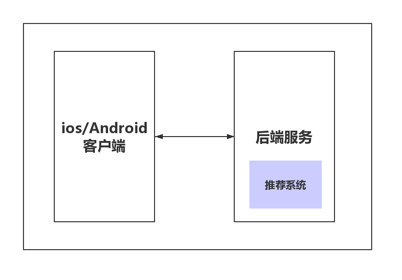
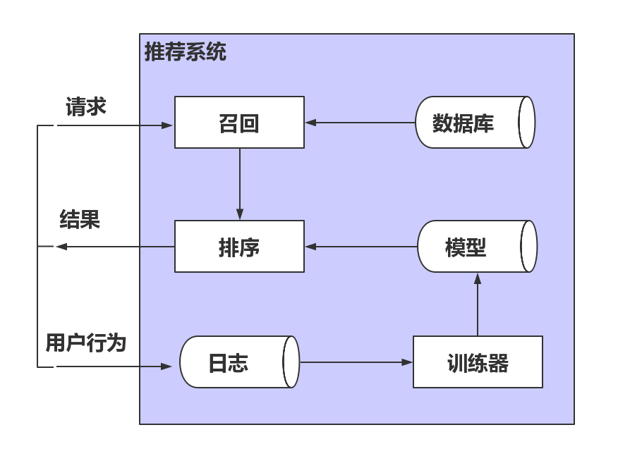
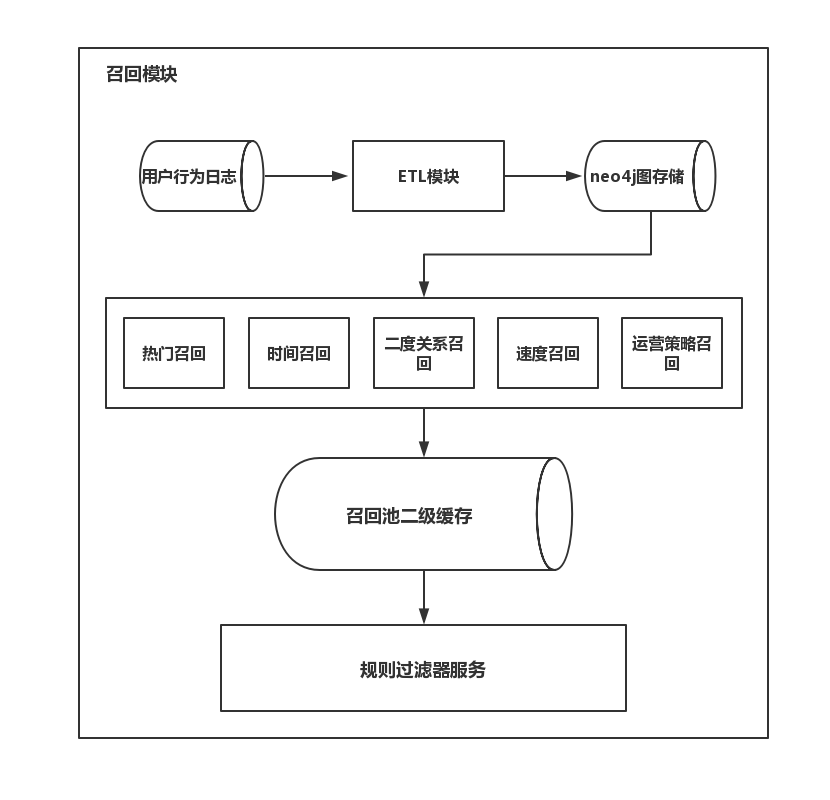
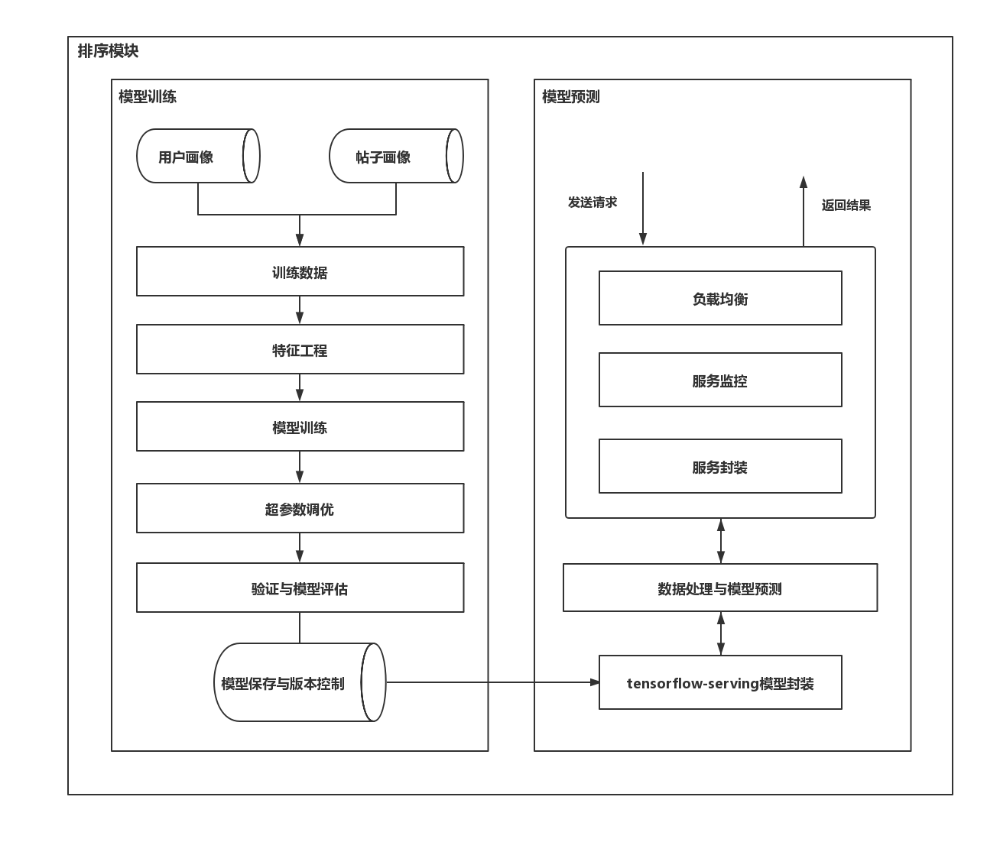

# 1.2 推荐系统架构介绍

## 学习目标

- 目标
  - 了解泛娱乐推荐系统前后端架构
  - 说明泛娱乐推荐系统架构
  - 说明召回模块的结构以及流程
  - 说明排序模块的结构以及流程
- 应用
  - 无

###1.2.1 泛娱乐推荐系统前后端结构

* 推荐系统嵌入在后端框架当中，作为一个模块调用
* 前端：提供IOS/Android客户端
* 后端：使用python Django Web框架

#### 1.2.1.1 主要目标以及方案

* 推荐系统的主要目标: 

通过向用户推荐更合适的帖子, 增加用户交互行为(点赞，评论，转发，收藏等), 进而增加用户平均使用时长。(在数据分析侧，相关实验表明: 用户交互行为与该用户的APP使用时长成正相关.)推荐系统应满足的用户体验要求: 多样性，新颖性和数据合理性。
* 推荐系统的冷启动方案:
  *  推荐系统使用热门召回, 时间召回，和运营策略召回作为最初推荐方案，并将该方案作为推荐效果对比基线。

* 推荐系统的总体设计必须满足数据闭环逻辑: 即用户最新产生的数据应及时用于更新召回策略和排序模型，以便更好的响应用户需求变化

### 1.2.2 推荐系统架构设计

* 推荐系统架构: Retrive-Ranking(召回-排序)。召回模块与排序模块是该推荐系统的重要组成部分

### 1.2.3 召回模块概述

- 召回模块作用: 针对当前用户尽可能多的覆盖其喜好而进行帖子的筛选。
- 召回模块组成: 召回模块包括, ETL模块, 召回池(包含各种召回策略), 召回池二级缓存, 规则过滤器服务。
- 召回策略计算技术解决方案: 图数据neo4j的内部计算与查询。
- ETL模块计算技术解决方案: 使用AWS弹性云计算服务, 针对海量数据进行处理, 以最小的代价获取和配置计算能力。

#### 召回模块组成图

### 1.2.4 排序模块概述

- 排序模块作用: 针对当前用户的召回数据进行指定数量的筛选并排序来对应产品推荐位置。
- 排序模块组成: 模型训练和预测服务。
- 模型训练技术解决方案: GCP云端分布式训练与tensorflow。
- 模型预测技术解决方案: GCP云端预测服务。

#### 排序模块组成图

